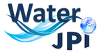

# airGRiwrm: airGR based Integrated Water Resource Management R package

<!-- badges: start -->
[](https://cran.r-project.org/package=airGRiwrm)
[](https://cran.r-project.org/package=airGRiwrm)
[](https://cran.r-project.org/web/licenses/AGPL-3)
[](https://doi.org/10.15454/3CVD1I)
[](https://gitlab.irstea.fr/in-wop/airGRiwrm/-/pipelines)
<!-- badges: end -->

**airGRiwrm** is an extension of the **airGR** R package for managing semi-distributive hydrological model on an anthropized catchment.

This package is developed as part of the IN-WOP project (http://www.waterjpi.eu/joint-calls/joint-call-2018-waterworks-2017/booklet/in-wop) by the mixed research unit G-EAU (https://g-eau.fr) and the HYDRO team of the INRAE HYCAR research unit (https://webgr.inrae.fr/en/home/).

## Installation

```r
# Install stable version from CRAN
install.packages("airGRiwrm")

# Or the development version from GitHub:
# install.packages("devtools")
devtools::install_github("inrae/airGRiwrm", "dev")
```

## Get started

Visit the website dedicated to the package at https://airgriwrm.g-eau.fr for tutorials, usage examples and documentation.

## Acknowledgement

The authors would like to thank the European Commission and the French National Research Agency (ANR) for funding in the frame of the collaborative  international consortium [IN-WOP](http://www.waterjpi.eu/joint-calls/joint-call-2018-waterworks-2017/booklet/in-wop) financed under the 2018 Joint call of the WaterWorks2017 ERA-NET Cofund. This ERA-NET is an integral part of the activities developed by the Water JPI.

<div style="display: flex; justify-content: space-between;">   </div>
