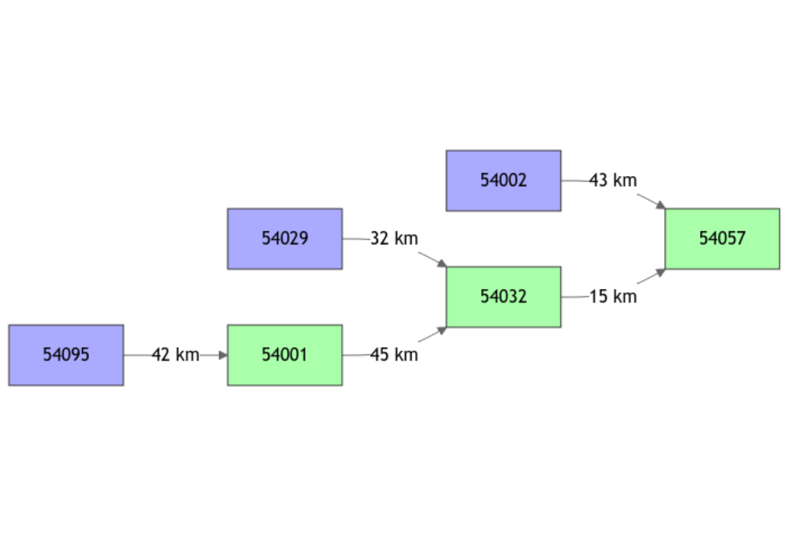

# Severn_01: Set up of a semi-distributed GR model network

``` r

library(airGRiwrm)
```

    #> Loading required package: airGR

    #> 
    #> Attaching package: 'airGRiwrm'

    #> The following objects are masked from 'package:airGR':
    #> 
    #>     Calibration, CreateCalibOptions, CreateInputsCrit,
    #>     CreateInputsModel, CreateRunOptions, RunModel

The package **airGRiwrm** is a modeling tool for integrated water
resources management based on the **airGR** package (See Coron et al.
2017).

In a semi-distributed model, the catchment is divided into several
sub-catchments. Each sub-catchment is an hydrological entity where a
runfall-runoff model produces a flow time series at the outlet of the
sub-catchment. Then, these flows are propagated from sub-catchment
outlets thanks to a hydraulic function to model the flow at the outlet
of the whole catchment. The aim of **airGRiwrm** is to organize the
structure and schedule the execution of the hydrological and hydraulic
sub-models contained in the semi-distributed model.

In this vignette, we show how to prepare observation data for the model.

### Description of the example used in this tutorial

The example of this tutorial takes place on the Severn River in the
United Kingdom. The data set comes from the CAMELS GB database (see
Coxon et al. 2020).

``` r

data(Severn)
Severn$BasinsInfo
```

    #>   gauge_id                 gauge_name gauge_lat gauge_lon    area elev_mean
    #> 1    54057       Severn at Haw Bridge     51.95     -2.23 9885.46       145
    #> 2    54032      Severn at Saxons Lode     52.05     -2.20 6864.88       170
    #> 3    54001          Severn at Bewdley     52.38     -2.32 4329.90       175
    #> 4    54095         Severn at Buildwas     52.64     -2.53 3722.68       186
    #> 5    54002            Avon at Evesham     52.09     -1.94 2207.95        99
    #> 6    54029 Teme at Knightsford Bridge     52.20     -2.39 1483.65       212
    #>   station_type flow_period_start flow_period_end bankfull_flow downstream_id
    #> 1           VA        1971-07-01      2015-09-30           460          <NA>
    #> 2           US        1970-10-01      2015-09-30           340         54057
    #> 3           US        1970-10-01      2015-09-30           420         54032
    #> 4           US        1984-03-01      2015-09-30           285         54001
    #> 5           VA        1970-10-01      2015-09-30           125         54057
    #> 6           FV        1970-10-01      2015-09-30           190         54032
    #>   distance_downstream
    #> 1                  NA
    #> 2                  15
    #> 3                  45
    #> 4                  42
    #> 5                  43
    #> 6                  32

### Semi-distributed network description

The semi-distributed model comprises nodes. Each node, identified by an
ID, represents a location where water is injected to or withdrawn from
the network.

The description of the topology consists, for each node, in providing
several fields:

- the node ID,
- the ID of the first node located downstream (set to `NA` for the last
  downstream node (i.e. the outlet of the simulated catchment)),
- the distance (m) between these two nodes (set to `NA` for the last
  downstream node),
- an area (km²) related to the node in case a hydrological model is used
  (otherwise set to `NA`).

Below, we constitute a `data.frame` bringing together all this
information for the tutorial example:

``` r

nodes <- Severn$BasinsInfo[, c("gauge_id", "downstream_id", "distance_downstream", "area")]
nodes$model <- "RunModel_GR4J"
```

The network description consists in a `GRiwrm` object that lists the
nodes and describes the network diagram. It is a `data.frame` of class
`GRiwrm` with specific column names:

- `id`: the identifier of the node in the network,
- `down`: the identifier of the next hydrological node downstream,
- `length`: hydraulic distance to the next hydrological downstream node
  (m),
- `model`: name of the hydrological model used (E.g. “RunModel_GR4J”).
  `NA` for other types of nodes,
- `area`: area of the sub-catchment (km²). Used for hydrological model
  such as GR models. `NA` if not used.

The `GRiwrm` function helps to create an object of class `GRiwrm`. It
renames the columns of the `data.frame`.

``` r

griwrm <- CreateGRiwrm(nodes, list(id = "gauge_id", down = "downstream_id", length = "distance_downstream"))
griwrm
```

    #>      id  down length    area         model donor
    #> 4 54095 54001     42 3722.68 RunModel_GR4J 54095
    #> 5 54002 54057     43 2207.95 RunModel_GR4J 54002
    #> 6 54029 54032     32 1483.65 RunModel_GR4J 54029
    #> 3 54001 54032     45 4329.90 RunModel_GR4J 54001
    #> 2 54032 54057     15 6864.88 RunModel_GR4J 54032
    #> 1 54057  <NA>     NA 9885.46 RunModel_GR4J 54057

The diagram of the network structure is represented below with in blue
the upstream nodes with a GR4J model and in green the intermediate nodes
with an SD (GR4J + LAG) model.

``` r

plot(griwrm)
```



### Observation time series

Observations (precipitation, potential evapotranspiration (PE) and
flows) should be formatted in a separate data.frame with one column of
data per sub-catchment.

``` r

BasinsObs <- Severn$BasinsObs
str(BasinsObs)
```

    #> List of 6
    #>  $ 54001:'data.frame':   11536 obs. of  4 variables:
    #>   ..$ DatesR        : POSIXct[1:11536], format: "1984-03-01" "1984-03-02" ...
    #>   ..$ precipitation : num [1:11536] 3.63 0.55 2.09 0.38 0.01 0.25 0.1 0 0.11 0.08 ...
    #>   ..$ peti          : num [1:11536] 0.59 1.65 1.44 0.3 0.58 0.73 0.59 0.66 0.58 0.62 ...
    #>   ..$ discharge_spec: num [1:11536] 0.77 0.77 0.76 0.74 0.72 0.69 0.64 0.6 0.59 0.54 ...
    #>  $ 54002:'data.frame':   11536 obs. of  4 variables:
    #>   ..$ DatesR        : POSIXct[1:11536], format: "1984-03-01" "1984-03-02" ...
    #>   ..$ precipitation : num [1:11536] 1.58 0.47 1.35 1.92 0.06 0 0.01 0 0.08 0.34 ...
    #>   ..$ peti          : num [1:11536] 0.61 1.7 1.61 0.3 0.44 0.69 0.52 0.71 0.73 0.57 ...
    #>   ..$ discharge_spec: num [1:11536] 0.62 0.63 0.56 0.52 0.52 0.54 0.5 0.48 0.46 0.45 ...
    #>  $ 54029:'data.frame':   11536 obs. of  4 variables:
    #>   ..$ DatesR        : POSIXct[1:11536], format: "1984-03-01" "1984-03-02" ...
    #>   ..$ precipitation : num [1:11536] 2.38 0.33 2.16 0.38 0.01 0.12 0.08 0.05 0.05 0.29 ...
    #>   ..$ peti          : num [1:11536] 0.58 1.64 1.49 0.23 0.56 0.72 0.63 0.72 0.62 0.64 ...
    #>   ..$ discharge_spec: num [1:11536] 0.79 0.79 0.73 0.7 0.68 0.63 0.61 0.59 0.57 0.57 ...
    #>  $ 54032:'data.frame':   11536 obs. of  4 variables:
    #>   ..$ DatesR        : POSIXct[1:11536], format: "1984-03-01" "1984-03-02" ...
    #>   ..$ precipitation : num [1:11536] 3.07 0.49 2.12 0.51 0.01 0.19 0.08 0.01 0.08 0.14 ...
    #>   ..$ peti          : num [1:11536] 0.59 1.64 1.47 0.27 0.57 0.72 0.61 0.68 0.6 0.63 ...
    #>   ..$ discharge_spec: num [1:11536] 0.84 0.83 0.81 0.79 0.78 0.73 0.65 0.61 0.6 0.57 ...
    #>  $ 54057:'data.frame':   11536 obs. of  4 variables:
    #>   ..$ DatesR        : POSIXct[1:11536], format: "1984-03-01" "1984-03-02" ...
    #>   ..$ precipitation : num [1:11536] 2.61 0.46 1.9 0.91 0.02 0.13 0.06 0.01 0.08 0.22 ...
    #>   ..$ peti          : num [1:11536] 0.59 1.65 1.51 0.28 0.53 0.71 0.59 0.69 0.64 0.62 ...
    #>   ..$ discharge_spec: num [1:11536] 0.66 0.67 0.64 0.64 0.63 0.61 0.56 0.52 0.51 0.5 ...
    #>  $ 54095:'data.frame':   11536 obs. of  4 variables:
    #>   ..$ DatesR        : POSIXct[1:11536], format: "1984-03-01" "1984-03-02" ...
    #>   ..$ precipitation : num [1:11536] 4.01 0.57 2 0.37 0.01 0.3 0.12 0 0.12 0.07 ...
    #>   ..$ peti          : num [1:11536] 0.59 1.64 1.42 0.31 0.59 0.73 0.59 0.66 0.57 0.61 ...
    #>   ..$ discharge_spec: num [1:11536] 0.9 0.9 0.94 0.87 0.86 0.81 0.76 0.73 0.7 0.69 ...

``` r

DatesR <- BasinsObs[[1]]$DatesR

PrecipTot <- cbind(sapply(BasinsObs, function(x) {x$precipitation}))
PotEvapTot <- cbind(sapply(BasinsObs, function(x) {x$peti}))
Qobs <- cbind(sapply(BasinsObs, function(x) {x$discharge_spec}))
```

These meteorological data consist in mean precipitation and PE for each
basin. However, the model needs mean precipitation and PE at sub-basin
scale. The function `ConvertMeteoSD` calculates these values for
downstream sub-basins:

``` r

Precip <- ConvertMeteoSD(griwrm, PrecipTot)
PotEvap <- ConvertMeteoSD(griwrm, PotEvapTot)
```

### Generation of the GRiwrmInputsModel object

The `GRiwrmInputsModel` object is a list of **airGR** `InputsModel`
objects. The identifier of the sub-basin is used as a key in the list
which is ordered from upstream to downstream.

The **airGR** `CreateInputsModel` function is extended in order to
handle the `GRiwrm` object that describes the basin diagram:

``` r

InputsModel <- CreateInputsModel(griwrm, DatesR, Precip, PotEvap)
```

    #> CreateInputsModel.GRiwrm: Processing sub-basin 54095...

    #> CreateInputsModel.GRiwrm: Processing sub-basin 54002...

    #> CreateInputsModel.GRiwrm: Processing sub-basin 54029...

    #> CreateInputsModel.GRiwrm: Processing sub-basin 54001...

    #> CreateInputsModel.GRiwrm: Processing sub-basin 54032...

    #> CreateInputsModel.GRiwrm: Processing sub-basin 54057...

## References

Coron, L., G. Thirel, O. Delaigue, C. Perrin, and V. Andréassian. 2017.
“The Suite of Lumped GR Hydrological Models in an R Package.”
*Environmental Modelling & Software* 94 (August): 166–71.
<https://doi.org/10.1016/j.envsoft.2017.05.002>.

Coxon, G., N. Addor, J. P. Bloomfield, et al. 2020. *Catchment
Attributes and Hydro-Meteorological Timeseries for 671 Catchments Across
Great Britain (CAMELS-GB)*. NERC Environmental Information Data Centre.
<https://doi.org/10.5285/8344E4F3-D2EA-44F5-8AFA-86D2987543A9>.
