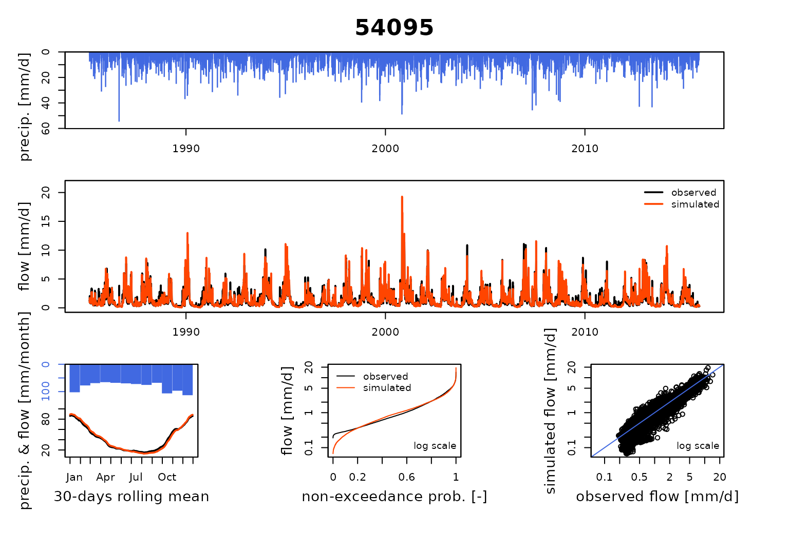
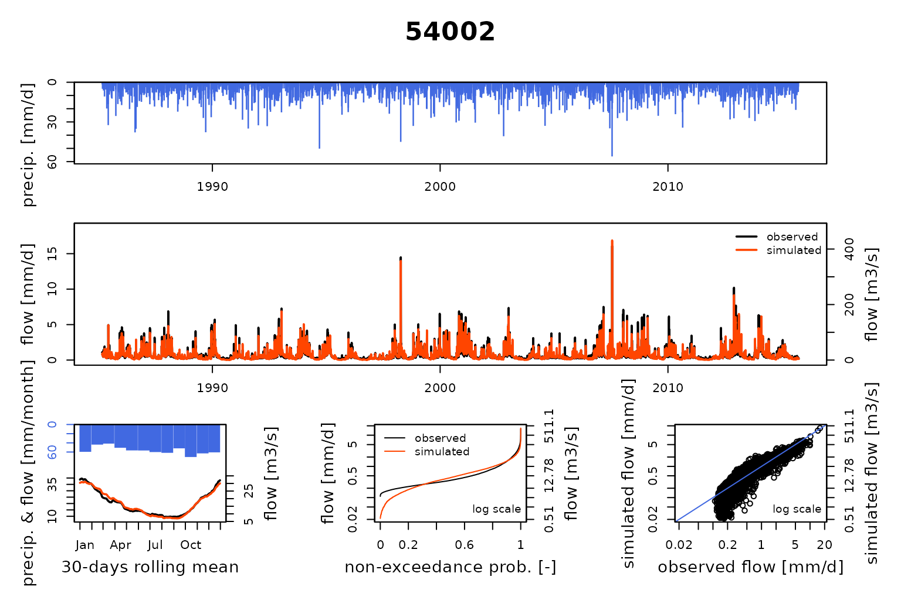
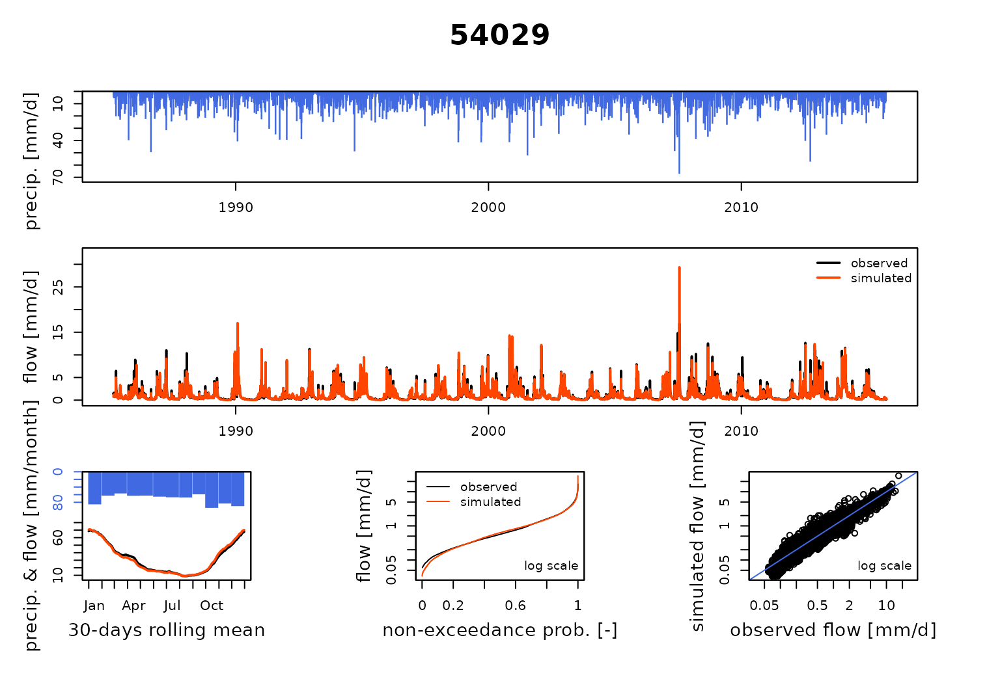
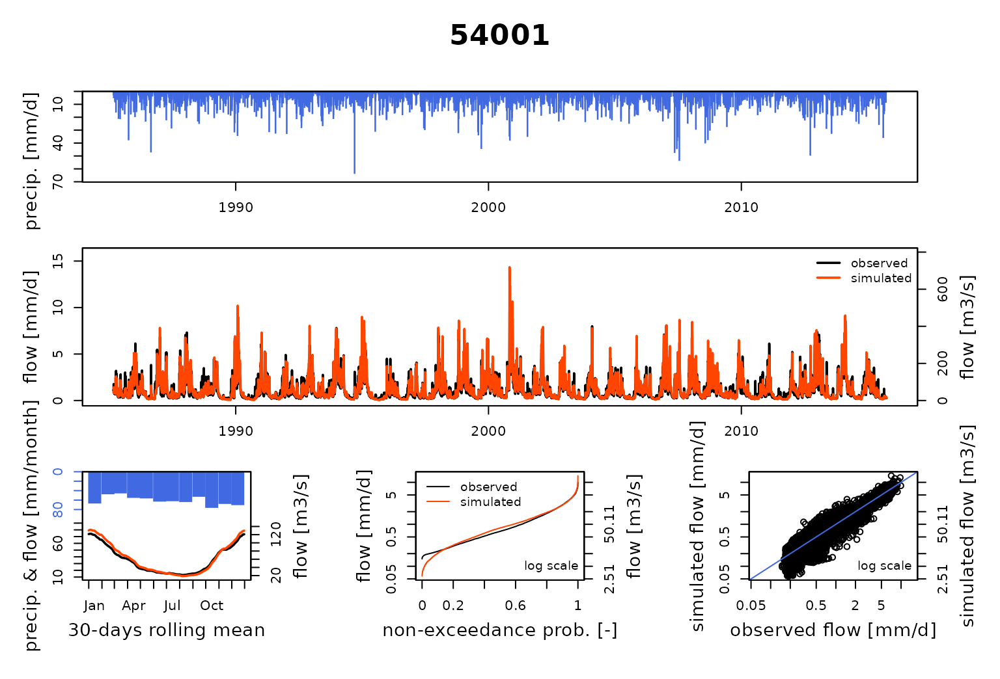
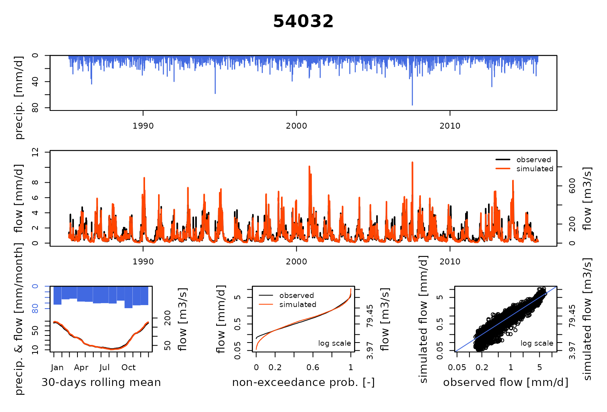
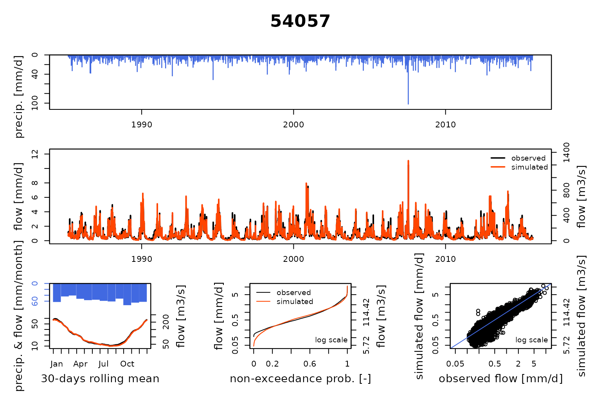
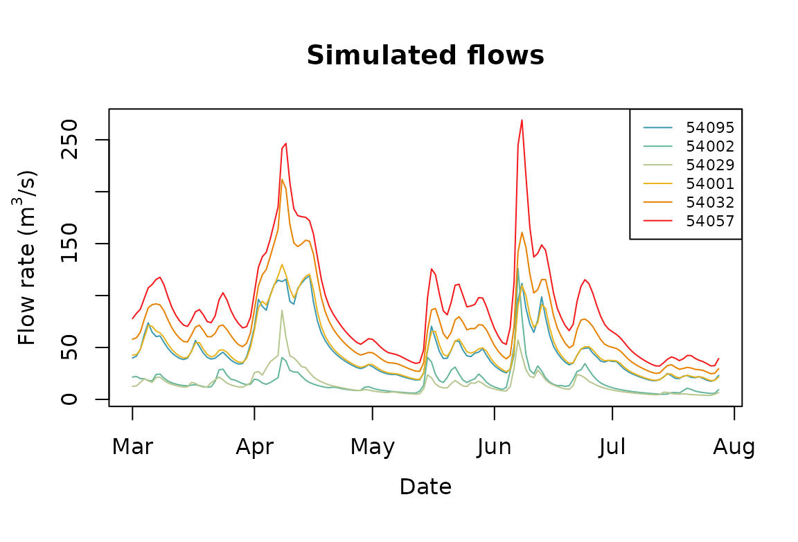

# Severn_02: Calibration of a GR4J semi-distributed model network

**airGRiwrm** automates the execution of **airGR** semi-distributed
models. The steps for running or calibrating the model are the same as
the ones of ‘airGR’.

## Load library

``` r
library(airGRiwrm)
```

    #> Loading required package: airGR

    #> 
    #> Attaching package: 'airGRiwrm'

    #> The following objects are masked from 'package:airGR':
    #> 
    #>     Calibration, CreateCalibOptions, CreateInputsCrit,
    #>     CreateInputsModel, CreateRunOptions, RunModel

## Preparation of function inputs

To run a model, as for **airGR**, the functions of the **airGRiwrm**
package (e.g. the models, calibration and criteria calculation
functions) require data and options with specific formats.

To facilitate the use of the package, there are several functions
dedicated to the creation of these objects:

- [`CreateInputsModel()`](https://inrae.github.io/airGRiwrm/dev/reference/CreateInputsModel.md):
  prepares the inputs for the different hydrological models (times
  series of dates, precipitation, observed discharge, etc.)
- [`CreateRunOptions()`](https://inrae.github.io/airGRiwrm/dev/reference/CreateRunOptions.md):
  prepares the options for the hydrological model run (warm up period,
  calibration period, etc.)
- [`CreateInputsCrit()`](https://inrae.github.io/airGRiwrm/dev/reference/CreateInputsCrit.md):
  prepares the options in order to compute the efficiency criterion
  (choice of the criterion, choice of the transformation on discharge:
  “log”, “sqrt”, etc.)
- [`CreateCalibOptions()`](https://inrae.github.io/airGRiwrm/dev/reference/CreateCalibOptions.md):
  prepares the options for the hydrological model calibration algorithm
  (choice of parameters to optimize, predefined values for uncalibrated
  parameters, etc.)

### GRiwrmInputsModel object

The method used for producing the `GRiwrmInputsModel` object is detailed
in the vignette “V01_Structure_SD_model” of the package. The following
code chunk resumes all the steps of this vignette:

``` r
data(Severn)
nodes <- Severn$BasinsInfo[, c("gauge_id", "downstream_id", "distance_downstream", "area")]
nodes$model <- "RunModel_GR4J"
griwrm <- CreateGRiwrm(nodes, list(id = "gauge_id", down = "downstream_id", length = "distance_downstream"))
BasinsObs <- Severn$BasinsObs
DatesR <- BasinsObs[[1]]$DatesR
PrecipTot <- cbind(sapply(BasinsObs, function(x) {x$precipitation}))
PotEvapTot <- cbind(sapply(BasinsObs, function(x) {x$peti}))
Qobs <- cbind(sapply(BasinsObs, function(x) {x$discharge_spec}))
Precip <- ConvertMeteoSD(griwrm, PrecipTot)
PotEvap <- ConvertMeteoSD(griwrm, PotEvapTot)
InputsModel <- CreateInputsModel(griwrm, DatesR, Precip, PotEvap)
```

    #> CreateInputsModel.GRiwrm: Processing sub-basin 54095...

    #> CreateInputsModel.GRiwrm: Processing sub-basin 54002...

    #> CreateInputsModel.GRiwrm: Processing sub-basin 54029...

    #> CreateInputsModel.GRiwrm: Processing sub-basin 54001...

    #> CreateInputsModel.GRiwrm: Processing sub-basin 54032...

    #> CreateInputsModel.GRiwrm: Processing sub-basin 54057...

``` r
str(InputsModel)
```

    #> List of 6
    #>  $ 54095:List of 14
    #>   ..$ DatesR           : POSIXlt[1:11536], format: "1984-03-01" "1984-03-02" ...
    #>   ..$ Precip           : num [1:11536] 4.01 0.57 2 0.37 0.01 0.3 0.12 0 0.12 0.07 ...
    #>   ..$ PotEvap          : num [1:11536] 0.59 1.64 1.42 0.31 0.59 0.73 0.59 0.66 0.57 0.61 ...
    #>   ..$ id               : chr "54095"
    #>   ..$ down             : chr "54001"
    #>   ..$ BasinAreas       : num 3723
    #>   ..$ FUN_MOD          : chr "RunModel_GR4J"
    #>   ..$ inUngaugedCluster: logi FALSE
    #>   ..$ isReceiver       : logi FALSE
    #>   ..$ gaugedId         : chr "54095"
    #>   ..$ hasUngaugedNodes : logi FALSE
    #>   ..$ model            :List of 4
    #>   .. ..$ indexParamUngauged: num [1:4] 2 3 4 5
    #>   .. ..$ hasX4             : logi TRUE
    #>   .. ..$ iX4               : num 4
    #>   .. ..$ IsHyst            : logi FALSE
    #>   ..$ hasDiversion     : logi FALSE
    #>   ..$ isReservoir      : logi FALSE
    #>   ..- attr(*, "FeatFUN_MOD")=List of 11
    #>   .. ..$ CodeMod     : chr "GR4J"
    #>   .. ..$ NameMod     : chr "GR4J"
    #>   .. ..$ NbParam     : int 4
    #>   .. ..$ TimeUnit    : chr "daily"
    #>   .. ..$ Id          : logi NA
    #>   .. ..$ Class       : chr [1:2] "daily" "GR"
    #>   .. ..$ Pkg         : chr "airGR"
    #>   .. ..$ NameFunMod  : chr "RunModel_GR4J"
    #>   .. ..$ TimeStep    : num 86400
    #>   .. ..$ TimeStepMean: int 86400
    #>   .. ..$ CodeModHydro: chr "GR4J"
    #>   ..- attr(*, "class")= chr [1:4] "RunModel_GR4J" "InputsModel" "daily" "GR"
    #>  $ 54002:List of 14
    #>   ..$ DatesR           : POSIXlt[1:11536], format: "1984-03-01" "1984-03-02" ...
    #>   ..$ Precip           : num [1:11536] 1.58 0.47 1.35 1.92 0.06 0 0.01 0 0.08 0.34 ...
    #>   ..$ PotEvap          : num [1:11536] 0.61 1.7 1.61 0.3 0.44 0.69 0.52 0.71 0.73 0.57 ...
    #>   ..$ id               : chr "54002"
    #>   ..$ down             : chr "54057"
    #>   ..$ BasinAreas       : num 2208
    #>   ..$ FUN_MOD          : chr "RunModel_GR4J"
    #>   ..$ inUngaugedCluster: logi FALSE
    #>   ..$ isReceiver       : logi FALSE
    #>   ..$ gaugedId         : chr "54002"
    #>   ..$ hasUngaugedNodes : logi FALSE
    #>   ..$ model            :List of 4
    #>   .. ..$ indexParamUngauged: num [1:4] 2 3 4 5
    #>   .. ..$ hasX4             : logi TRUE
    #>   .. ..$ iX4               : num 4
    #>   .. ..$ IsHyst            : logi FALSE
    #>   ..$ hasDiversion     : logi FALSE
    #>   ..$ isReservoir      : logi FALSE
    #>   ..- attr(*, "FeatFUN_MOD")=List of 11
    #>   .. ..$ CodeMod     : chr "GR4J"
    #>   .. ..$ NameMod     : chr "GR4J"
    #>   .. ..$ NbParam     : int 4
    #>   .. ..$ TimeUnit    : chr "daily"
    #>   .. ..$ Id          : logi NA
    #>   .. ..$ Class       : chr [1:2] "daily" "GR"
    #>   .. ..$ Pkg         : chr "airGR"
    #>   .. ..$ NameFunMod  : chr "RunModel_GR4J"
    #>   .. ..$ TimeStep    : num 86400
    #>   .. ..$ TimeStepMean: int 86400
    #>   .. ..$ CodeModHydro: chr "GR4J"
    #>   ..- attr(*, "class")= chr [1:4] "RunModel_GR4J" "InputsModel" "daily" "GR"
    #>  $ 54029:List of 14
    #>   ..$ DatesR           : POSIXlt[1:11536], format: "1984-03-01" "1984-03-02" ...
    #>   ..$ Precip           : num [1:11536] 2.38 0.33 2.16 0.38 0.01 0.12 0.08 0.05 0.05 0.29 ...
    #>   ..$ PotEvap          : num [1:11536] 0.58 1.64 1.49 0.23 0.56 0.72 0.63 0.72 0.62 0.64 ...
    #>   ..$ id               : chr "54029"
    #>   ..$ down             : chr "54032"
    #>   ..$ BasinAreas       : num 1484
    #>   ..$ FUN_MOD          : chr "RunModel_GR4J"
    #>   ..$ inUngaugedCluster: logi FALSE
    #>   ..$ isReceiver       : logi FALSE
    #>   ..$ gaugedId         : chr "54029"
    #>   ..$ hasUngaugedNodes : logi FALSE
    #>   ..$ model            :List of 4
    #>   .. ..$ indexParamUngauged: num [1:4] 2 3 4 5
    #>   .. ..$ hasX4             : logi TRUE
    #>   .. ..$ iX4               : num 4
    #>   .. ..$ IsHyst            : logi FALSE
    #>   ..$ hasDiversion     : logi FALSE
    #>   ..$ isReservoir      : logi FALSE
    #>   ..- attr(*, "FeatFUN_MOD")=List of 11
    #>   .. ..$ CodeMod     : chr "GR4J"
    #>   .. ..$ NameMod     : chr "GR4J"
    #>   .. ..$ NbParam     : int 4
    #>   .. ..$ TimeUnit    : chr "daily"
    #>   .. ..$ Id          : logi NA
    #>   .. ..$ Class       : chr [1:2] "daily" "GR"
    #>   .. ..$ Pkg         : chr "airGR"
    #>   .. ..$ NameFunMod  : chr "RunModel_GR4J"
    #>   .. ..$ TimeStep    : num 86400
    #>   .. ..$ TimeStepMean: int 86400
    #>   .. ..$ CodeModHydro: chr "GR4J"
    #>   ..- attr(*, "class")= chr [1:4] "RunModel_GR4J" "InputsModel" "daily" "GR"
    #>  $ 54001:List of 19
    #>   ..$ DatesR           : POSIXlt[1:11536], format: "1984-03-01" "1984-03-02" ...
    #>   ..$ Precip           : num [1:11536] 1.3 0.427 2.642 0.441 0.01 ...
    #>   ..$ PotEvap          : num [1:11536] 0.59 1.711 1.563 0.239 0.519 ...
    #>   ..$ Qupstream        : num [1:11536, 1] 0 0 0 0 0 0 0 0 0 0 ...
    #>   .. ..- attr(*, "dimnames")=List of 2
    #>   .. .. ..$ : NULL
    #>   .. .. ..$ : chr "54095"
    #>   ..$ LengthHydro      : Named num 42
    #>   .. ..- attr(*, "names")= chr "54095"
    #>   ..$ BasinAreas       : Named num [1:2] 3723 607
    #>   .. ..- attr(*, "names")= chr [1:2] "54095" "54001"
    #>   ..$ id               : chr "54001"
    #>   ..$ down             : chr "54032"
    #>   ..$ UpstreamNodes    : chr "54095"
    #>   ..$ UpstreamIsModeled: Named logi TRUE
    #>   .. ..- attr(*, "names")= chr "54095"
    #>   ..$ UpstreamVarQ     : Named chr "Qsim_m3"
    #>   .. ..- attr(*, "names")= chr "54095"
    #>   ..$ FUN_MOD          : chr "RunModel_GR4J"
    #>   ..$ inUngaugedCluster: logi FALSE
    #>   ..$ isReceiver       : logi FALSE
    #>   ..$ gaugedId         : chr "54001"
    #>   ..$ hasUngaugedNodes : logi FALSE
    #>   ..$ model            :List of 4
    #>   .. ..$ indexParamUngauged: num [1:5] 1 2 3 4 5
    #>   .. ..$ hasX4             : logi TRUE
    #>   .. ..$ iX4               : num 5
    #>   .. ..$ IsHyst            : logi FALSE
    #>   ..$ hasDiversion     : logi FALSE
    #>   ..$ isReservoir      : logi FALSE
    #>   ..- attr(*, "FeatFUN_MOD")=List of 11
    #>   .. ..$ CodeMod     : chr "GR4J"
    #>   .. ..$ NameMod     : chr "GR4J"
    #>   .. ..$ NbParam     : int 4
    #>   .. ..$ TimeUnit    : chr "daily"
    #>   .. ..$ Id          : logi NA
    #>   .. ..$ Class       : chr [1:2] "daily" "GR"
    #>   .. ..$ Pkg         : chr "airGR"
    #>   .. ..$ NameFunMod  : chr "RunModel_GR4J"
    #>   .. ..$ TimeStep    : num 86400
    #>   .. ..$ TimeStepMean: int 86400
    #>   .. ..$ CodeModHydro: chr "GR4J"
    #>   ..- attr(*, "class")= chr [1:5] "RunModel_GR4J" "InputsModel" "daily" "GR" ...
    #>  $ 54032:List of 19
    #>   ..$ DatesR           : POSIXlt[1:11536], format: "1984-03-01" "1984-03-02" ...
    #>   ..$ Precip           : num [1:11536] 1.737 0.469 2.187 1.229 0.01 ...
    #>   ..$ PotEvap          : num [1:11536] 0.604 1.599 1.565 0.203 0.543 ...
    #>   ..$ Qupstream        : num [1:11536, 1:2] 0 0 0 0 0 0 0 0 0 0 ...
    #>   .. ..- attr(*, "dimnames")=List of 2
    #>   .. .. ..$ : NULL
    #>   .. .. ..$ : chr [1:2] "54029" "54001"
    #>   ..$ LengthHydro      : Named num [1:2] 32 45
    #>   .. ..- attr(*, "names")= chr [1:2] "54029" "54001"
    #>   ..$ BasinAreas       : Named num [1:3] 1484 4330 1051
    #>   .. ..- attr(*, "names")= chr [1:3] "54029" "54001" "54032"
    #>   ..$ id               : chr "54032"
    #>   ..$ down             : chr "54057"
    #>   ..$ UpstreamNodes    : chr [1:2] "54029" "54001"
    #>   ..$ UpstreamIsModeled: Named logi [1:2] TRUE TRUE
    #>   .. ..- attr(*, "names")= chr [1:2] "54029" "54001"
    #>   ..$ UpstreamVarQ     : Named chr [1:2] "Qsim_m3" "Qsim_m3"
    #>   .. ..- attr(*, "names")= chr [1:2] "54029" "54001"
    #>   ..$ FUN_MOD          : chr "RunModel_GR4J"
    #>   ..$ inUngaugedCluster: logi FALSE
    #>   ..$ isReceiver       : logi FALSE
    #>   ..$ gaugedId         : chr "54032"
    #>   ..$ hasUngaugedNodes : logi FALSE
    #>   ..$ model            :List of 4
    #>   .. ..$ indexParamUngauged: num [1:5] 1 2 3 4 5
    #>   .. ..$ hasX4             : logi TRUE
    #>   .. ..$ iX4               : num 5
    #>   .. ..$ IsHyst            : logi FALSE
    #>   ..$ hasDiversion     : logi FALSE
    #>   ..$ isReservoir      : logi FALSE
    #>   ..- attr(*, "FeatFUN_MOD")=List of 11
    #>   .. ..$ CodeMod     : chr "GR4J"
    #>   .. ..$ NameMod     : chr "GR4J"
    #>   .. ..$ NbParam     : int 4
    #>   .. ..$ TimeUnit    : chr "daily"
    #>   .. ..$ Id          : logi NA
    #>   .. ..$ Class       : chr [1:2] "daily" "GR"
    #>   .. ..$ Pkg         : chr "airGR"
    #>   .. ..$ NameFunMod  : chr "RunModel_GR4J"
    #>   .. ..$ TimeStep    : num 86400
    #>   .. ..$ TimeStepMean: int 86400
    #>   .. ..$ CodeModHydro: chr "GR4J"
    #>   ..- attr(*, "class")= chr [1:5] "RunModel_GR4J" "InputsModel" "daily" "GR" ...
    #>  $ 54057:List of 19
    #>   ..$ DatesR           : POSIXlt[1:11536], format: "1984-03-01" "1984-03-02" ...
    #>   ..$ Precip           : num [1:11536] 1.523 0.179 1.536 1.545 0 ...
    #>   ..$ PotEvap          : num [1:11536] 0.536 1.599 1.576 0.31 0.437 ...
    #>   ..$ Qupstream        : num [1:11536, 1:2] 0 0 0 0 0 0 0 0 0 0 ...
    #>   .. ..- attr(*, "dimnames")=List of 2
    #>   .. .. ..$ : NULL
    #>   .. .. ..$ : chr [1:2] "54002" "54032"
    #>   ..$ LengthHydro      : Named num [1:2] 43 15
    #>   .. ..- attr(*, "names")= chr [1:2] "54002" "54032"
    #>   ..$ BasinAreas       : Named num [1:3] 2208 6865 813
    #>   .. ..- attr(*, "names")= chr [1:3] "54002" "54032" "54057"
    #>   ..$ id               : chr "54057"
    #>   ..$ down             : chr NA
    #>   ..$ UpstreamNodes    : chr [1:2] "54002" "54032"
    #>   ..$ UpstreamIsModeled: Named logi [1:2] TRUE TRUE
    #>   .. ..- attr(*, "names")= chr [1:2] "54002" "54032"
    #>   ..$ UpstreamVarQ     : Named chr [1:2] "Qsim_m3" "Qsim_m3"
    #>   .. ..- attr(*, "names")= chr [1:2] "54002" "54032"
    #>   ..$ FUN_MOD          : chr "RunModel_GR4J"
    #>   ..$ inUngaugedCluster: logi FALSE
    #>   ..$ isReceiver       : logi FALSE
    #>   ..$ gaugedId         : chr "54057"
    #>   ..$ hasUngaugedNodes : logi FALSE
    #>   ..$ model            :List of 4
    #>   .. ..$ indexParamUngauged: num [1:5] 1 2 3 4 5
    #>   .. ..$ hasX4             : logi TRUE
    #>   .. ..$ iX4               : num 5
    #>   .. ..$ IsHyst            : logi FALSE
    #>   ..$ hasDiversion     : logi FALSE
    #>   ..$ isReservoir      : logi FALSE
    #>   ..- attr(*, "FeatFUN_MOD")=List of 11
    #>   .. ..$ CodeMod     : chr "GR4J"
    #>   .. ..$ NameMod     : chr "GR4J"
    #>   .. ..$ NbParam     : int 4
    #>   .. ..$ TimeUnit    : chr "daily"
    #>   .. ..$ Id          : logi NA
    #>   .. ..$ Class       : chr [1:2] "daily" "GR"
    #>   .. ..$ Pkg         : chr "airGR"
    #>   .. ..$ NameFunMod  : chr "RunModel_GR4J"
    #>   .. ..$ TimeStep    : num 86400
    #>   .. ..$ TimeStepMean: int 86400
    #>   .. ..$ CodeModHydro: chr "GR4J"
    #>   ..- attr(*, "class")= chr [1:5] "RunModel_GR4J" "InputsModel" "daily" "GR" ...
    #>  - attr(*, "class")= chr [1:2] "GRiwrmInputsModel" "list"
    #>  - attr(*, "GRiwrm")=Classes 'GRiwrm' and 'data.frame':  6 obs. of  6 variables:
    #>   ..$ id    : chr [1:6] "54095" "54002" "54029" "54001" ...
    #>   ..$ down  : chr [1:6] "54001" "54057" "54032" "54032" ...
    #>   ..$ length: num [1:6] 42 43 32 45 15 NA
    #>   ..$ area  : num [1:6] 3723 2208 1484 4330 6865 ...
    #>   ..$ model : chr [1:6] "RunModel_GR4J" "RunModel_GR4J" "RunModel_GR4J" "RunModel_GR4J" ...
    #>   ..$ donor : chr [1:6] "54095" "54002" "54029" "54001" ...
    #>  - attr(*, "TimeStep")= num 86400

## GRiwrmRunOptions object

The
[`CreateRunOptions()`](https://inrae.github.io/airGRiwrm/dev/reference/CreateRunOptions.md)
function allows to prepare the options required for the
[`RunModel()`](https://inrae.github.io/airGRiwrm/dev/reference/RunModel.md)
function.

The user must at least define the following arguments:

- `InputsModel`: the associated input data
- `IndPeriod_Run`: the period on which the model is run

Below, we define a one-year warm up period and we start the run period
just after the warm up period.

``` r
IndPeriod_Run <- seq(
  which(InputsModel[[1]]$DatesR == (InputsModel[[1]]$DatesR[1] + 365*24*60*60)), # Set aside warm-up period
  length(InputsModel[[1]]$DatesR) # Until the end of the time series
)
IndPeriod_WarmUp <- seq(1, IndPeriod_Run[1] - 1)
```

Arguments of the `CreateRunOptions` function for **airGRiwrm** are the
same as for the function in **airGR** and are copied for each node
running a rainfall-runoff model.

``` r
RunOptions <- CreateRunOptions(
  InputsModel,
  IndPeriod_WarmUp = IndPeriod_WarmUp,
  IndPeriod_Run = IndPeriod_Run
)
```

## GRiwrmInputsCrit object

The
[`CreateInputsCrit()`](https://inrae.github.io/airGRiwrm/dev/reference/CreateInputsCrit.md)
function allows to prepare the input in order to calculate a criterion.
We use composed criterion with a parameter regularization based on
@delavenneRegularizationApproachImprove2019.

It needs the following arguments:

- `InputsModel`: the inputs of the `GRiwrm` network previously prepared
  by the
  [`CreateInputsModel()`](https://inrae.github.io/airGRiwrm/dev/reference/CreateInputsModel.md)
  function
- `FUN_CRIT`: the name of the error criterion function (see the
  available functions description in the **airGR** package)
- `RunOptions`: the options of the `GRiwrm` network previously prepared
  by the
  [`CreateRunOptions()`](https://inrae.github.io/airGRiwrm/dev/reference/CreateRunOptions.md)
  function
- `Qobs`: the observed variable time series (e.g. the discharge
  expressed in *mm/time step*)
- `AprioriIds`: the list of the sub-catchments IDs where to apply a
  parameter regularization based on the parameters of an upstream
  sub-catchment (e.g. here below the parameters of the sub-catchment
  “54057” is regulated by the parameters of the sub-catchment “54032”)
- `transfo`: a transformation function applied on the flow before
  calculation of the criterion (square-root transformation is
  recommended for the De Lavenne regularization)
- `k`: coefficient used for the weighted average between the performance
  criterion and the gap between the optimized parameter set and an a
  priori parameter set (a value equal to 0.15 is recommended for the De
  Lavenne regularization)

``` r
InputsCrit <- CreateInputsCrit(
  InputsModel = InputsModel,
  FUN_CRIT = ErrorCrit_KGE2,
  RunOptions = RunOptions,
  Obs = Qobs[IndPeriod_Run, ],
  AprioriIds = c(
      "54057" = "54032",
      "54032" = "54001",
      "54001" = "54095"
  ),
  transfo = "sqrt",
  k = 0.15
)
str(InputsCrit)
```

    #> List of 6
    #>  $ 54095:List of 8
    #>   ..$ FUN_CRIT:function (InputsCrit, OutputsModel, warnings = TRUE, verbose = TRUE)  
    #>   .. ..- attr(*, "class")= chr [1:2] "FUN_CRIT" "function"
    #>   ..$ Obs     : num [1:11171] 1.19 1.17 1.25 1.51 2.05 1.61 1.34 1.34 1.17 1.06 ...
    #>   ..$ VarObs  : chr "Q"
    #>   ..$ BoolCrit: logi [1:11171] TRUE TRUE TRUE TRUE TRUE TRUE ...
    #>   ..$ idLayer : logi NA
    #>   ..$ transfo : chr "sqrt"
    #>   ..$ epsilon : NULL
    #>   ..$ Weights : NULL
    #>   ..- attr(*, "class")= chr [1:2] "Single" "InputsCrit"
    #>  $ 54002:List of 8
    #>   ..$ FUN_CRIT:function (InputsCrit, OutputsModel, warnings = TRUE, verbose = TRUE)  
    #>   .. ..- attr(*, "class")= chr [1:2] "FUN_CRIT" "function"
    #>   ..$ Obs     : num [1:11171] 1.09 1.13 1.07 1.04 0.82 0.68 0.87 0.88 0.77 0.68 ...
    #>   ..$ VarObs  : chr "Q"
    #>   ..$ BoolCrit: logi [1:11171] TRUE TRUE TRUE TRUE TRUE TRUE ...
    #>   ..$ idLayer : logi NA
    #>   ..$ transfo : chr "sqrt"
    #>   ..$ epsilon : NULL
    #>   ..$ Weights : NULL
    #>   ..- attr(*, "class")= chr [1:2] "Single" "InputsCrit"
    #>  $ 54029:List of 8
    #>   ..$ FUN_CRIT:function (InputsCrit, OutputsModel, warnings = TRUE, verbose = TRUE)  
    #>   .. ..- attr(*, "class")= chr [1:2] "FUN_CRIT" "function"
    #>   ..$ Obs     : num [1:11171] 1.37 1.31 1.52 1.6 1.29 1.14 1.45 1.47 1.23 1.12 ...
    #>   ..$ VarObs  : chr "Q"
    #>   ..$ BoolCrit: logi [1:11171] TRUE TRUE TRUE TRUE TRUE TRUE ...
    #>   ..$ idLayer : logi NA
    #>   ..$ transfo : chr "sqrt"
    #>   ..$ epsilon : NULL
    #>   ..$ Weights : NULL
    #>   ..- attr(*, "class")= chr [1:2] "Single" "InputsCrit"
    #>  $ 54001:List of 8
    #>   ..$ FUN_CRIT:function (InputsCrit, OutputsModel, warnings = TRUE, verbose = TRUE)  
    #>   .. ..- attr(*, "class")= chr [1:2] "FUN_CRIT" "function"
    #>   ..$ Obs     : num [1:11171] 1.1 1.05 1.19 1.29 1.77 1.49 1.31 1.27 1.1 0.97 ...
    #>   ..$ VarObs  : chr "Q"
    #>   ..$ BoolCrit: logi [1:11171] TRUE TRUE TRUE TRUE TRUE TRUE ...
    #>   ..$ idLayer : logi NA
    #>   ..$ transfo : chr "sqrt"
    #>   ..$ epsilon : NULL
    #>   ..$ Weights : NULL
    #>   ..- attr(*, "class")= chr [1:3] "InputsCritLavenneFunction" "Single" "InputsCrit"
    #>   ..- attr(*, "Lavenne_FUN")=function (AprParamR, AprCrit)  
    #>   ..- attr(*, "AprioriId")= Named chr "54095"
    #>   .. ..- attr(*, "names")= chr "54001"
    #>   ..- attr(*, "AprCelerity")= num 1
    #>   ..- attr(*, "model")=List of 5
    #>   .. ..$ indexParamUngauged: num [1:5] 1 2 3 4 5
    #>   .. ..$ hasX4             : logi TRUE
    #>   .. ..$ iX4               : num 5
    #>   .. ..$ IsHyst            : logi FALSE
    #>   .. ..$ X4Ratio           : num 0.58
    #>  $ 54032:List of 8
    #>   ..$ FUN_CRIT:function (InputsCrit, OutputsModel, warnings = TRUE, verbose = TRUE)  
    #>   .. ..- attr(*, "class")= chr [1:2] "FUN_CRIT" "function"
    #>   ..$ Obs     : num [1:11171] 1.19 1.19 1.23 1.35 1.43 1.37 1.32 1.35 1.21 1.07 ...
    #>   ..$ VarObs  : chr "Q"
    #>   ..$ BoolCrit: logi [1:11171] TRUE TRUE TRUE TRUE TRUE TRUE ...
    #>   ..$ idLayer : logi NA
    #>   ..$ transfo : chr "sqrt"
    #>   ..$ epsilon : NULL
    #>   ..$ Weights : NULL
    #>   ..- attr(*, "class")= chr [1:3] "InputsCritLavenneFunction" "Single" "InputsCrit"
    #>   ..- attr(*, "Lavenne_FUN")=function (AprParamR, AprCrit)  
    #>   ..- attr(*, "AprioriId")= Named chr "54001"
    #>   .. ..- attr(*, "names")= chr "54032"
    #>   ..- attr(*, "AprCelerity")= num 1
    #>   ..- attr(*, "model")=List of 5
    #>   .. ..$ indexParamUngauged: num [1:5] 1 2 3 4 5
    #>   .. ..$ hasX4             : logi TRUE
    #>   .. ..$ iX4               : num 5
    #>   .. ..$ IsHyst            : logi FALSE
    #>   .. ..$ X4Ratio           : num 1.18
    #>  $ 54057:List of 8
    #>   ..$ FUN_CRIT:function (InputsCrit, OutputsModel, warnings = TRUE, verbose = TRUE)  
    #>   .. ..- attr(*, "class")= chr [1:2] "FUN_CRIT" "function"
    #>   ..$ Obs     : num [1:11171] 1.06 1.1 1.09 1.22 1.23 1.21 1.18 1.25 1.13 0.98 ...
    #>   ..$ VarObs  : chr "Q"
    #>   ..$ BoolCrit: logi [1:11171] TRUE TRUE TRUE TRUE TRUE TRUE ...
    #>   ..$ idLayer : logi NA
    #>   ..$ transfo : chr "sqrt"
    #>   ..$ epsilon : NULL
    #>   ..$ Weights : NULL
    #>   ..- attr(*, "class")= chr [1:3] "InputsCritLavenneFunction" "Single" "InputsCrit"
    #>   ..- attr(*, "Lavenne_FUN")=function (AprParamR, AprCrit)  
    #>   ..- attr(*, "AprioriId")= Named chr "54032"
    #>   .. ..- attr(*, "names")= chr "54057"
    #>   ..- attr(*, "AprCelerity")= num 1
    #>   ..- attr(*, "model")=List of 5
    #>   .. ..$ indexParamUngauged: num [1:5] 1 2 3 4 5
    #>   .. ..$ hasX4             : logi TRUE
    #>   .. ..$ iX4               : num 5
    #>   .. ..$ IsHyst            : logi FALSE
    #>   .. ..$ X4Ratio           : num 0.926
    #>  - attr(*, "class")= chr [1:2] "GRiwrmInputsCrit" "list"

### GRiwrmCalibOptions object

Before using the automatic calibration tool, the user needs to prepare
the calibration options with the
[`CreateCalibOptions()`](https://inrae.github.io/airGRiwrm/dev/reference/CreateCalibOptions.md)
function. The `GRiwrmInputsModel` argument contains all the necessary
information:

``` r
CalibOptions <- CreateCalibOptions(InputsModel)
```

## Calibration

The **airGR** calibration process is applied on each node of the
`GRiwrm` network from upstream nodes to downstream nodes.

``` r
OutputsCalib <- suppressWarnings(
  Calibration(InputsModel, RunOptions, InputsCrit, CalibOptions))
```

    #> Calibration.GRiwrmInputsModel: Processing sub-basin '54095'...

    #> Grid-Screening in progress (0% 20% 40% 60% 80% 100%)
    #>   Screening completed (81 runs)
    #>       Param =  247.151,   -0.020,   83.096,    2.384
    #>       Crit. KGE2[sqrt(Q)] = 0.9507
    #> Steepest-descent local search in progress
    #>   Calibration completed (37 iterations, 377 runs)
    #>       Param =  305.633,    0.061,   48.777,    2.733
    #>       Crit. KGE2[sqrt(Q)] = 0.9578
    #> Calibration.GRiwrmInputsModel: Processing sub-basin '54002'...
    #> Grid-Screening in progress (0% 20% 40% 60% 80% 100%)
    #>   Screening completed (81 runs)
    #>       Param =  432.681,   -0.020,   20.697,    1.944
    #>       Crit. KGE2[sqrt(Q)] = 0.9264
    #> Steepest-descent local search in progress
    #>   Calibration completed (18 iterations, 209 runs)
    #>       Param =  389.753,    0.085,   17.870,    2.098
    #>       Crit. KGE2[sqrt(Q)] = 0.9370
    #> Calibration.GRiwrmInputsModel: Processing sub-basin '54029'...
    #> Grid-Screening in progress (0% 20% 40% 60% 80% 100%)
    #>   Screening completed (81 runs)
    #>       Param =  247.151,   -0.020,   42.098,    1.944
    #>       Crit. KGE2[sqrt(Q)] = 0.9541
    #> Steepest-descent local search in progress
    #>   Calibration completed (32 iterations, 333 runs)
    #>       Param =  214.204,   -0.119,   46.754,    2.022
    #>       Crit. KGE2[sqrt(Q)] = 0.9696
    #> Calibration.GRiwrmInputsModel: Processing sub-basin '54001'...
    #> Parameter regularization: get a priori parameters from node 54095: 1, 305.633, 0.061, 48.777, 1.587
    #> Crit. KGE2[sqrt(Q)] = 0.9578
    #>  SubCrit. KGE2[sqrt(Q)] cor(sim, obs, "pearson") = 0.9579 
    #>  SubCrit. KGE2[sqrt(Q)] cv(sim)/cv(obs)          = 1.0023 
    #>  SubCrit. KGE2[sqrt(Q)] mean(sim)/mean(obs)      = 1.0007 
    #> 
    #> Grid-Screening in progress (0% 20% 40% 60% 80% 100%)
    #>   Screening completed (243 runs)
    #>       Param =    1.250,  247.151,   -2.376,   20.697,    1.417
    #>       Crit. Composite    = 0.9424
    #> Steepest-descent local search in progress
    #>   Calibration completed (24 iterations, 460 runs)
    #>       Param =    1.210,  301.871,   -3.005,   15.029,    1.622
    #>       Crit. Composite    = 0.9429
    #>  Formula: sum(0.86 * KGE2[sqrt(Q)], 0.14 * GAPX[ParamT])
    #> Calibration.GRiwrmInputsModel: Processing sub-basin '54032'...
    #> Parameter regularization: get a priori parameters from node 54001: 1.21, 301.871, -3.005, 15.029, 1.913
    #> Crit. KGE2[sqrt(Q)] = 0.9521
    #>  SubCrit. KGE2[sqrt(Q)] cor(sim, obs, "pearson") = 0.9608 
    #>  SubCrit. KGE2[sqrt(Q)] cv(sim)/cv(obs)          = 0.9985 
    #>  SubCrit. KGE2[sqrt(Q)] mean(sim)/mean(obs)      = 1.0274 
    #> 
    #> Grid-Screening in progress (0% 20% 40% 60% 80% 100%)
    #>   Screening completed (243 runs)
    #>       Param =    1.250,  432.681,   -2.376,   83.096,    1.944
    #>       Crit. Composite    = 0.9539
    #> Steepest-descent local search in progress
    #>   Calibration completed (30 iterations, 521 runs)
    #>       Param =    1.200, 1164.445,   -1.222,   24.047,    1.837
    #>       Crit. Composite    = 0.9603
    #>  Formula: sum(0.86 * KGE2[sqrt(Q)], 0.14 * GAPX[ParamT])
    #> Calibration.GRiwrmInputsModel: Processing sub-basin '54057'...
    #> Parameter regularization: get a priori parameters from node 54032: 1.2, 1164.445, -1.222, 24.047, 1.7
    #> Crit. KGE2[sqrt(Q)] = 0.9673
    #>  SubCrit. KGE2[sqrt(Q)] cor(sim, obs, "pearson") = 0.9683 
    #>  SubCrit. KGE2[sqrt(Q)] cv(sim)/cv(obs)          = 1.0078 
    #>  SubCrit. KGE2[sqrt(Q)] mean(sim)/mean(obs)      = 1.0007 
    #> 
    #> Grid-Screening in progress (0% 20% 40% 60% 80% 100%)
    #>   Screening completed (243 runs)
    #>       Param =    1.250,  432.681,   -0.649,   20.697,    1.944
    #>       Crit. Composite    = 0.9582
    #> Steepest-descent local search in progress
    #>   Calibration completed (29 iterations, 512 runs)
    #>       Param =    1.200, 1164.445,   -1.222,   24.047,    1.700
    #>       Crit. Composite    = 0.9645
    #>  Formula: sum(0.85 * KGE2[sqrt(Q)], 0.15 * GAPX[ParamT])

## Run the model with the optimized model parameters

``` r
OutputsModels <- RunModel(
  InputsModel,
  RunOptions = RunOptions,
  Param = extractParam(OutputsCalib)
)
```

    #> RunModel.GRiwrmInputsModel: Processing sub-basin 54095...

    #> RunModel.GRiwrmInputsModel: Processing sub-basin 54002...

    #> RunModel.GRiwrmInputsModel: Processing sub-basin 54029...

    #> RunModel.GRiwrmInputsModel: Processing sub-basin 54001...

    #> RunModel.GRiwrmInputsModel: Processing sub-basin 54032...

    #> RunModel.GRiwrmInputsModel: Processing sub-basin 54057...

## Plot the results for each basin

``` r
plot(OutputsModels, Qobs = Qobs[IndPeriod_Run,])
```



The resulting flows of each node in m³/s are directly available and can
be plotted with these commands:

``` r
Qm3s <- attr(OutputsModels, "Qm3s")
plot(Qm3s[1:150,])
```


