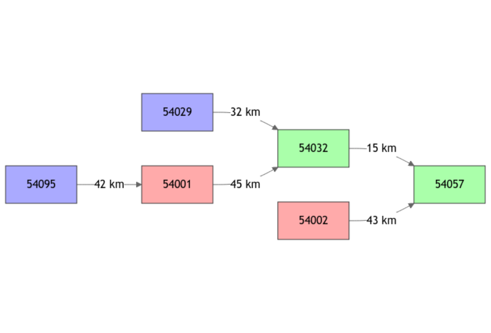
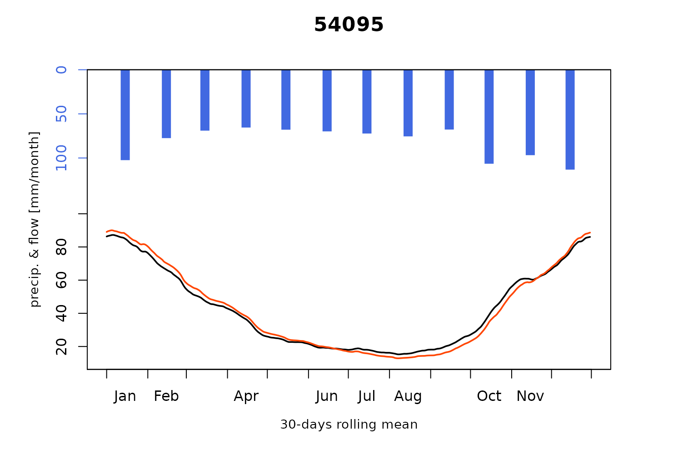
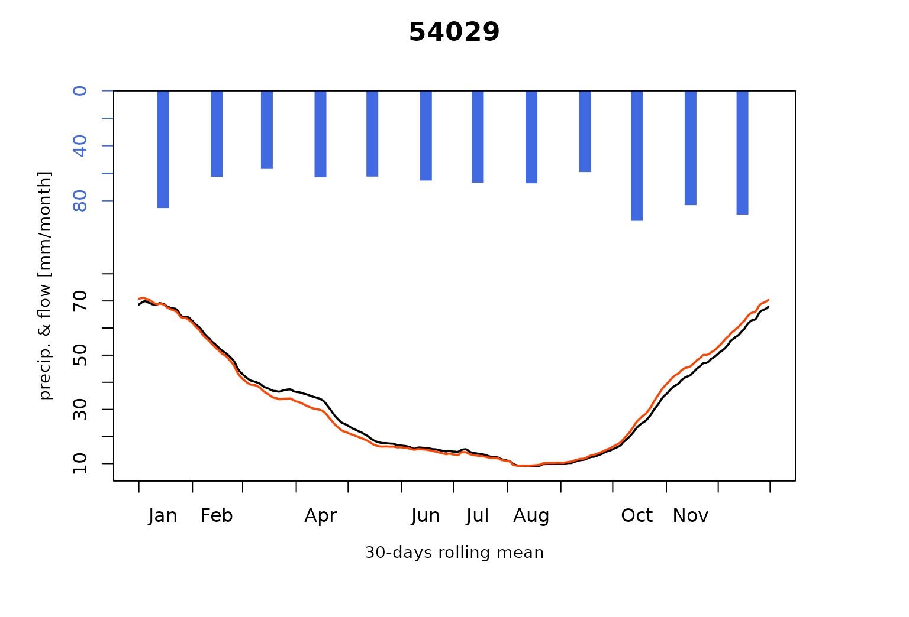
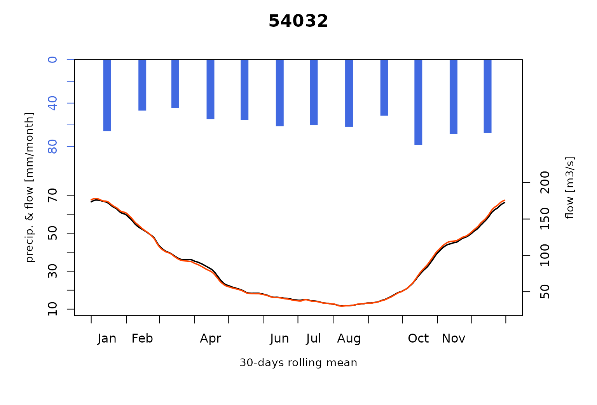
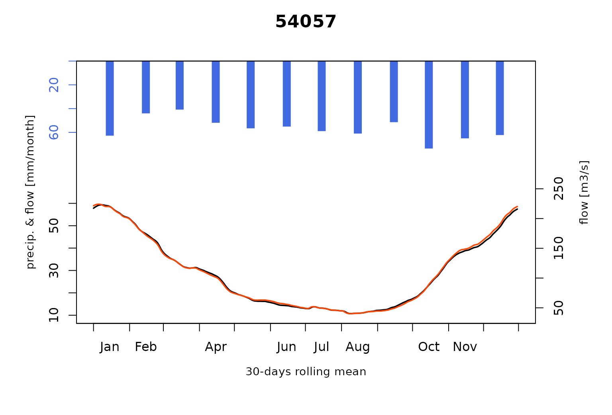
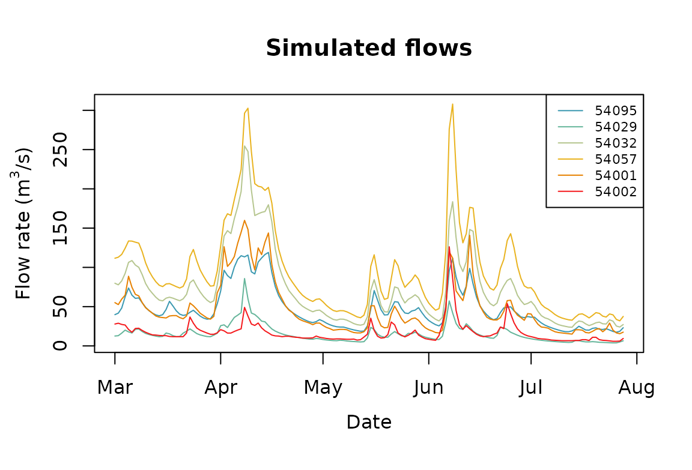

# Severn_03: Calibration of an open-loop influenced flow model network

``` r
library(airGRiwrm)
#> Loading required package: airGR
#> 
#> Attaching package: 'airGRiwrm'
#> The following objects are masked from 'package:airGR':
#> 
#>     Calibration, CreateCalibOptions, CreateInputsCrit,
#>     CreateInputsModel, CreateRunOptions, RunModel
```

### Presentation of the study case

The calibration results shown in vignette ‘V02_Calibration_SD_model’ for
the flows simulated on the Avon at Evesham (Gauging station ‘54002’) and
on the Severn at Buildwas (Gauging station ‘54095’) are not fully
satisfactory, especially regarding low flows. These upper basins are
actually heavily influenced by impoundments and inter-basin transfers
(Higgs and Petts 1988).

So, to cope with these influences, in this vignette, we use direct
injection of observed influenced flows instead of modeling natural flow
with an hydrological model.

We use observation on the Avon at Evesham (Gauging station ‘54002’) and
we choose to do the same on the Severn at Bewdley (Gauging station
‘54001’) as if the observed flow at these locations would be the
observed release of a dam.

Please note that the flow on the Severn at Buildwas (Gauging station
‘54095’) is still simulated but its flows is no longer routed to
downstream.

### Conversion of a gauging station into a release spot

#### Modification of the GRiwrm object

The creation of the `GRiwrm` object is detailed in the vignette
“V01_Structure_SD_model” of the package. The following code chunk
resumes all the necessary steps:

``` r
data(Severn)
nodes <- Severn$BasinsInfo[, c("gauge_id", "downstream_id", "distance_downstream", "area")]
nodes$model <- "RunModel_GR4J"
```

To notify the SD model that the provided flows on a node should be
directly used instead of an hydrological model, one only needs to
declare its model as `NA`:

``` r
nodes$model[nodes$gauge_id == "54002"] <- NA
nodes$model[nodes$gauge_id == "54001"] <- NA
griwrmV03 <- CreateGRiwrm(nodes, list(id = "gauge_id", down = "downstream_id", length = "distance_downstream"))
griwrmV03
#>      id  down length    area         model donor
#> 4 54095 54001     42 3722.68 RunModel_GR4J 54095
#> 6 54029 54032     32 1483.65 RunModel_GR4J 54029
#> 2 54032 54057     15 6864.88 RunModel_GR4J 54032
#> 1 54057  <NA>     NA 9885.46 RunModel_GR4J 54057
#> 3 54001 54032     45 4329.90          <NA>  <NA>
#> 5 54002 54057     43 2207.95          <NA>  <NA>
```

Here, we keep the area of this basin which means that the discharge will
be provided in mm per time step. If the discharge is provided in m³/s,
then the area should be set to `NA` and downstream basin areas should be
modified subsequently.

The diagram of the network structure is represented below with:

- in blue, the upstream nodes with a GR4J model
- in green, the intermediate nodes with an SD (GR4J + LAG) model
- in red, the node with direct flow injection (no hydrological model)

``` r
plot(griwrmV03)
```



#### Generation of the GRiwrmInputsModel object

The formatting of the input data is described in the vignette
“V01_Structure_SD_model”. The following code chunk resumes this
formatting procedure:

``` r
BasinsObs <- Severn$BasinsObs
DatesR <- BasinsObs[[1]]$DatesR
PrecipTot <- cbind(sapply(BasinsObs, function(x) {x$precipitation}))
PotEvapTot <- cbind(sapply(BasinsObs, function(x) {x$peti}))
Precip <- ConvertMeteoSD(griwrmV03, PrecipTot)
PotEvap <- ConvertMeteoSD(griwrmV03, PotEvapTot)
Qobs <- cbind(sapply(BasinsObs, function(x) {x$discharge_spec}))
```

This time, we need to provide observed flows as inputs for the nodes
‘54002’ and ‘54095’:

``` r
QobsInputs <- Qobs[, c("54001", "54002")]
```

Then, the `GRiwrmInputsModel` object can be generated taking into
account the new `GRiwrm` object:

``` r
IM_OL <- CreateInputsModel(griwrmV03, DatesR, Precip, PotEvap, QobsInputs)
#> CreateInputsModel.GRiwrm: Processing sub-basin 54095...
#> CreateInputsModel.GRiwrm: Processing sub-basin 54029...
#> CreateInputsModel.GRiwrm: Processing sub-basin 54032...
#> CreateInputsModel.GRiwrm: Processing sub-basin 54057...
```

### Calibration of the new model

Calibration options is detailed in vignette “V02_Calibration_SD_model”.
We also apply a parameter regularization here but only where an upstream
simulated catchment is available.

The following code chunk resumes this procedure:

``` r
IndPeriod_Run <- seq(
  which(DatesR == (DatesR[1] + 365*24*60*60)), # Set aside warm-up period
  length(DatesR) # Until the end of the time series
)
IndPeriod_WarmUp = seq(1,IndPeriod_Run[1]-1)
RunOptions <- CreateRunOptions(IM_OL,
                               IndPeriod_WarmUp = IndPeriod_WarmUp,
                               IndPeriod_Run = IndPeriod_Run)
InputsCrit <- CreateInputsCrit(IM_OL,
                               FUN_CRIT = ErrorCrit_KGE2,
                               RunOptions = RunOptions, Obs = Qobs[IndPeriod_Run,],
                               AprioriIds = c("54057" = "54032", "54032" = "54029"),
                               transfo = "sqrt", k = 0.15
)
CalibOptions <- CreateCalibOptions(IM_OL)
```

The **airGR** calibration process is applied on each hydrological node
of the `GRiwrm` network from upstream nodes to downstream nodes.

``` r
OC_OL <- suppressWarnings(
  Calibration(IM_OL, RunOptions, InputsCrit, CalibOptions))
#> Calibration.GRiwrmInputsModel: Processing sub-basin '54095'...
#> Grid-Screening in progress (0% 20% 40% 60% 80% 100%)
#>   Screening completed (81 runs)
#>       Param =  247.151,   -0.020,   83.096,    2.384
#>       Crit. KGE2[sqrt(Q)] = 0.9507
#> Steepest-descent local search in progress
#>   Calibration completed (37 iterations, 377 runs)
#>       Param =  305.633,    0.061,   48.777,    2.733
#>       Crit. KGE2[sqrt(Q)] = 0.9578
#> Calibration.GRiwrmInputsModel: Processing sub-basin '54029'...
#> Grid-Screening in progress (0% 20% 40% 60% 80% 100%)
#>   Screening completed (81 runs)
#>       Param =  247.151,   -0.020,   42.098,    1.944
#>       Crit. KGE2[sqrt(Q)] = 0.9541
#> Steepest-descent local search in progress
#>   Calibration completed (32 iterations, 333 runs)
#>       Param =  214.204,   -0.119,   46.754,    2.022
#>       Crit. KGE2[sqrt(Q)] = 0.9696
#> Calibration.GRiwrmInputsModel: Processing sub-basin '54032'...
#> Parameter regularization: get a priori parameters from node 54029: 1, 214.204, -0.119, 46.754, 1.823
#> Crit. KGE2[sqrt(Q)] = 0.9696
#>  SubCrit. KGE2[sqrt(Q)] cor(sim, obs, "pearson") = 0.9697 
#>  SubCrit. KGE2[sqrt(Q)] cv(sim)/cv(obs)          = 0.9975 
#>  SubCrit. KGE2[sqrt(Q)] mean(sim)/mean(obs)      = 0.9989 
#> 
#> Grid-Screening in progress (0% 20% 40% 60% 80% 100%)
#>   Screening completed (243 runs)
#>       Param =    1.250,  432.681,   -0.020,   42.098,    1.944
#>       Crit. Composite    = 0.9861
#> Steepest-descent local search in progress
#>   Calibration completed (17 iterations, 395 runs)
#>       Param =    1.110,  395.440,    0.000,   60.340,    1.788
#>       Crit. Composite    = 0.9876
#>  Formula: sum(0.85 * KGE2[sqrt(Q)], 0.15 * GAPX[ParamT])
#> Calibration.GRiwrmInputsModel: Processing sub-basin '54057'...
#> Parameter regularization: get a priori parameters from node 54032: 1.11, 395.44, 0, 60.34, 1.655
#> Crit. KGE2[sqrt(Q)] = 0.9913
#>  SubCrit. KGE2[sqrt(Q)] cor(sim, obs, "pearson") = 0.9916 
#>  SubCrit. KGE2[sqrt(Q)] cv(sim)/cv(obs)          = 1.0020 
#>  SubCrit. KGE2[sqrt(Q)] mean(sim)/mean(obs)      = 1.0010 
#> 
#> Grid-Screening in progress (0% 20% 40% 60% 80% 100%)
#>   Screening completed (243 runs)
#>       Param =    1.250,  247.151,   -0.020,   42.098,    1.944
#>       Crit. Composite    = 0.9786
#> Steepest-descent local search in progress
#>   Calibration completed (23 iterations, 452 runs)
#>       Param =    1.120,  230.442,   -0.242,   42.521,    1.710
#>       Crit. Composite    = 0.9797
#>  Formula: sum(0.85 * KGE2[sqrt(Q)], 0.15 * GAPX[ParamT])
ParamV03 <- sapply(griwrmV03$id, function(x) {OC_OL[[x]]$Param})
```

### Run of the model with this newly calibrated parameters

``` r
OM_OL <- RunModel(
  IM_OL,
  RunOptions = RunOptions,
  Param = ParamV03
)
#> RunModel.GRiwrmInputsModel: Processing sub-basin 54095...
#> RunModel.GRiwrmInputsModel: Processing sub-basin 54029...
#> RunModel.GRiwrmInputsModel: Processing sub-basin 54032...
#> RunModel.GRiwrmInputsModel: Processing sub-basin 54057...
```

### Plotting of the results

As can be seen below, compared to results of vignette
“V02_Calibration_SD_model”, the use of measured flows on upstream
influenced basins largely improves the model performance at downstream
stations (better low-flow simulations).

``` r
plot(OM_OL, Qobs = Qobs[IndPeriod_Run, ], which = "Regime")
```



The resulting flows of each node in m³/s are directly available and can
be plotted with these commands:

``` r
Qm3s <- attr(OM_OL, "Qm3s")
plot(Qm3s[1:150, ])
```



## References

Higgs, Gary, and Geoff Petts. 1988. “Hydrological Changes and River
Regulation in the UK.” *Regulated Rivers: Research & Management* 2 (3):
349–68. <https://doi.org/10.1002/rrr.3450020312>.
