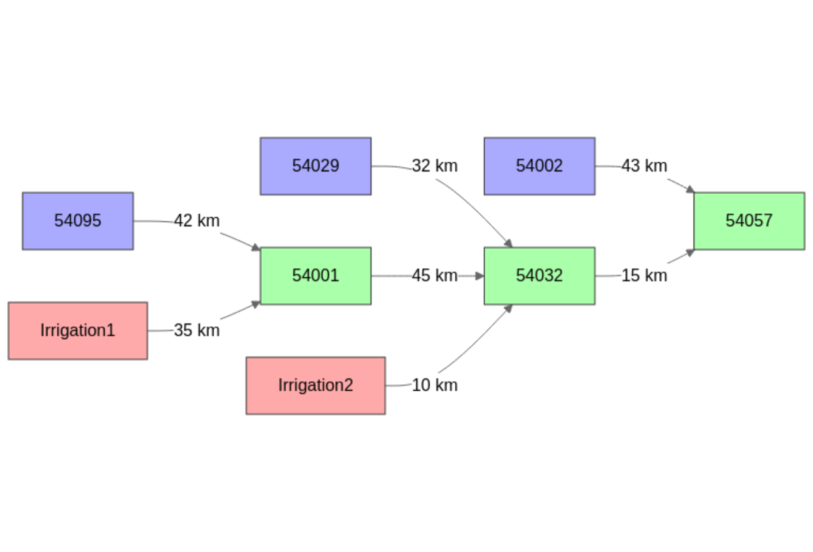
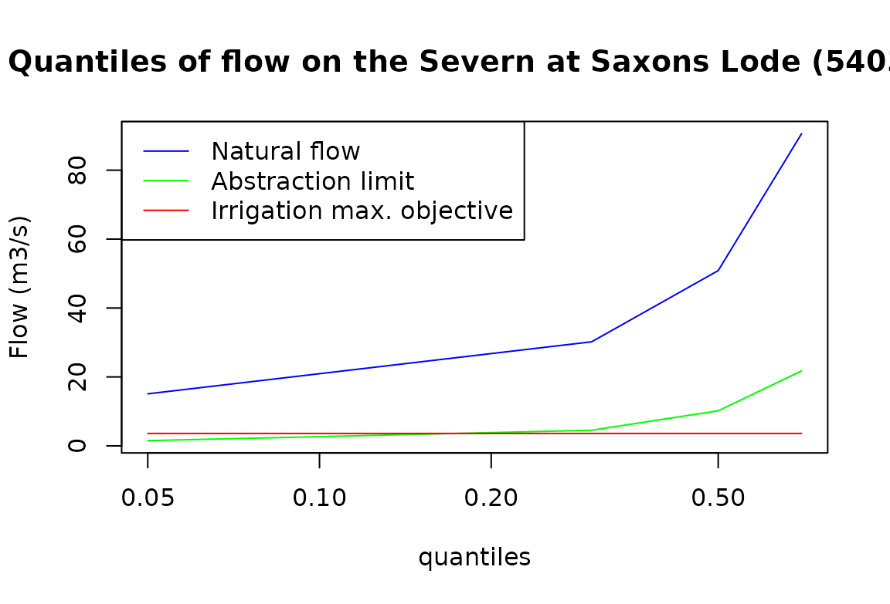
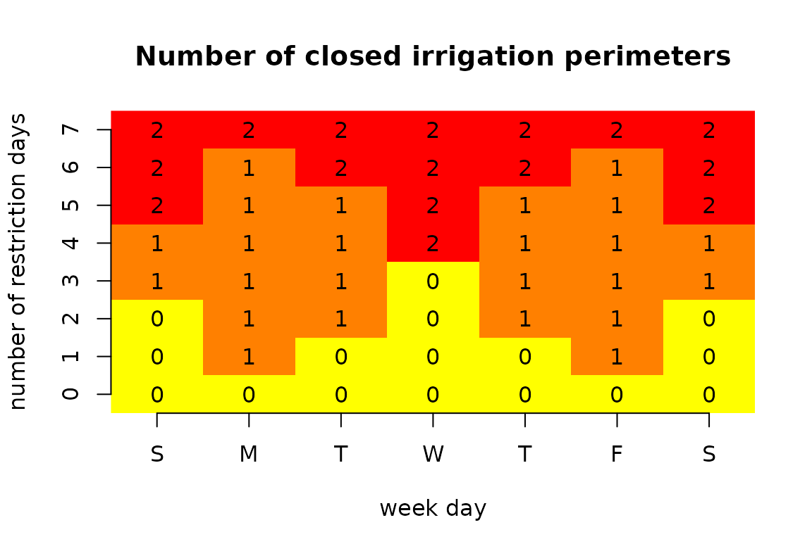
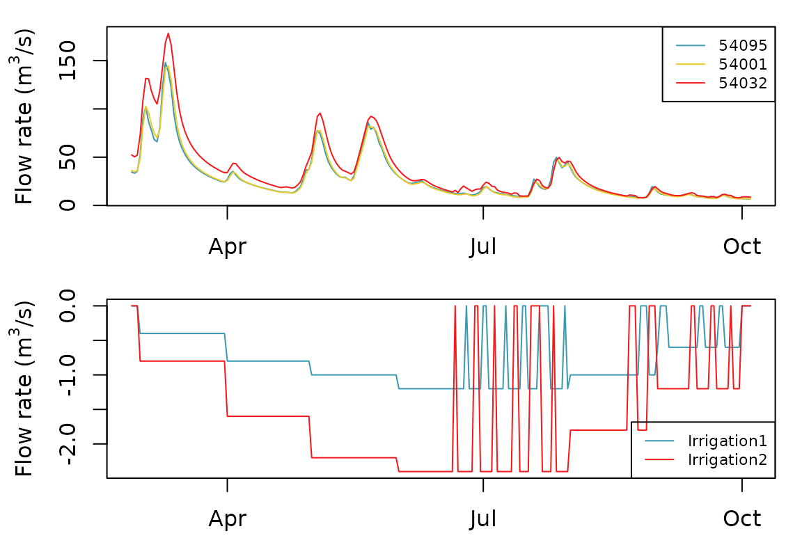

# Severn_04: Modeling a regulated withdrawal (closed-loop control)

``` r
library(airGRiwrm)
#> Loading required package: airGR
#> 
#> Attaching package: 'airGRiwrm'
#> The following objects are masked from 'package:airGR':
#> 
#>     Calibration, CreateCalibOptions, CreateInputsCrit,
#>     CreateInputsModel, CreateRunOptions, RunModel
```

## Presentation of the case study

Starting from the network and the calibration set in the vignette
“V02_Calibration_SD_model”, we add 2 intake points for irrigation.

### Network configuration

The following code chunk resumes the procedure of the vignette
“V02_Calibration_SD_model”:

``` r
data(Severn)
nodes <- Severn$BasinsInfo[, c("gauge_id", "downstream_id", "distance_downstream", "area")]
nodes$model <- "RunModel_GR4J"
```

The intake points are located:

- on the Severn at 35 km upstream Bewdley (Gauging station ‘54001’);
- on the Severn at 10 km upstream Saxons Lode (Gauging station ‘54032’).

We have to add this 2 nodes in the network:

``` r
nodes <- rbind(
  nodes,
  data.frame(
    gauge_id = c("Irrigation1", "Irrigation2"),
    downstream_id = c("54001", "54032"),
    distance_downstream = c(35, 10),
    model = NA,
    area = NA
  )
)

nodes
#>      gauge_id downstream_id distance_downstream    area         model
#> 1       54057          <NA>                  NA 9885.46 RunModel_GR4J
#> 2       54032         54057                  15 6864.88 RunModel_GR4J
#> 3       54001         54032                  45 4329.90 RunModel_GR4J
#> 4       54095         54001                  42 3722.68 RunModel_GR4J
#> 5       54002         54057                  43 2207.95 RunModel_GR4J
#> 6       54029         54032                  32 1483.65 RunModel_GR4J
#> 7 Irrigation1         54001                  35      NA          <NA>
#> 8 Irrigation2         54032                  10      NA          <NA>
```

And we create the `GRiwrm` object from this new network:

``` r
griwrmV04 <- CreateGRiwrm(nodes, list(id = "gauge_id", down = "downstream_id", length = "distance_downstream"))
plot(griwrmV04)
```



Blue nodes figure upstream basins (rainfall-runoff modeling only) and
green nodes figure intermediate basins, coupling rainfall-runoff and
hydraulic routing modeling. Nodes in red color are direct injection
points (positive or negative flow) in the model.

It’s important to notice that even if the points “Irrigation1” and
“Irrigation2” are physically located on a single branch of the Severn
river as well as gauging stations “54095”, “54001” and “54032”, nodes
“Irrigation1” and “Irrigation2” are not represented on the same branch
in this conceptual model. Consequently, with this network configuration,
it is not possible to know the value of the flow in the Severn river at
the “Irrigation1” or “Irrigation2” nodes. These values are only
available in nodes “54095”, “54001” and “54032” where rainfall-runoff
and hydraulic routing are actually modeled.

### Irrigation objectives and flow demand at intakes

Irrigation1 covers an area of 15 km² and Irrigation2 covers an area of
30 km².

The objective of these irrigation systems is to cover the rainfall
deficit (Burt et al. 1997) with 80% of success. Below is the calculation
of the 8^(th) decile of monthly water needed given meteorological data
of catchments “54001” and “54032” (unit mm/day) :

``` r
# Formatting climatic data for CreateInputsModel (See vignette V01_Structure_SD_model for details)
BasinsObs <- Severn$BasinsObs
DatesR <- BasinsObs[[1]]$DatesR
PrecipTot <- cbind(sapply(BasinsObs, function(x) {x$precipitation}))
PotEvapTot <- cbind(sapply(BasinsObs, function(x) {x$peti}))
Qobs <- cbind(sapply(BasinsObs, function(x) {x$discharge_spec}))
Precip <- ConvertMeteoSD(griwrmV04, PrecipTot)
PotEvap <- ConvertMeteoSD(griwrmV04, PotEvapTot)

# Calculation of the water need at the sub-basin scale
dailyWaterNeed <- PotEvap - Precip
dailyWaterNeed <- cbind(as.data.frame(DatesR), dailyWaterNeed[,c("54001", "54032")])
monthlyWaterNeed <- SeriesAggreg(dailyWaterNeed, "%Y%m", rep("mean",2))
monthlyWaterNeed <- SeriesAggreg(dailyWaterNeed, "%m", rep("q80",2))
monthlyWaterNeed[monthlyWaterNeed < 0] <- 0
monthlyWaterNeed$DatesR <- as.numeric(format(monthlyWaterNeed$DatesR,"%m"))
names(monthlyWaterNeed)[1] <- "month"
monthlyWaterNeed <- monthlyWaterNeed[order(monthlyWaterNeed$month),]
monthlyWaterNeed
#>       month     54001     54032
#> 25        1 0.2400000 0.2365627
#> 1721      2 0.5918416 0.6188486
#> 2804      3 1.2376475 1.2384480
#> 3745      4 2.1809664 2.2036046
#> 4721      5 3.0230456 3.0555408
#> 5716      6 3.4775922 3.5096402
#> 6722      7 3.5305228 3.5769480
#> 7644      8 2.6925228 2.7331421
#> 8637      9 1.8323644 1.8489218
#> 9588     10 0.8626301 0.8867260
#> 10554    11 0.2707842 0.2497664
#> 11491    12 0.1488753 0.1665834
```

We restrict the irrigation season between March and September As a
consequence, the crop requirement can be expressed in m³/s as follows:

``` r
irrigationObjective <- monthlyWaterNeed
# Conversion in m3/day
irrigationObjective$"54001" <- monthlyWaterNeed$"54001" * 15 * 1E3
irrigationObjective$"54032" <- monthlyWaterNeed$"54032" * 30 * 1E3
# Irrigation period between March and September
irrigationObjective[-seq(3,9),-1] <- 0
# Conversion in m3/s
irrigationObjective[,c(2,3)] <- round(irrigationObjective[,c(2,3)] / 86400, 1)
irrigationObjective$total <- rowSums(irrigationObjective[,c(2,3)])
irrigationObjective
#>       month 54001 54032 total
#> 25        1   0.0   0.0   0.0
#> 1721      2   0.0   0.0   0.0
#> 2804      3   0.2   0.4   0.6
#> 3745      4   0.4   0.8   1.2
#> 4721      5   0.5   1.1   1.6
#> 5716      6   0.6   1.2   1.8
#> 6722      7   0.6   1.2   1.8
#> 7644      8   0.5   0.9   1.4
#> 8637      9   0.3   0.6   0.9
#> 9588     10   0.0   0.0   0.0
#> 10554    11   0.0   0.0   0.0
#> 11491    12   0.0   0.0   0.0
```

We assume that the efficiency of the irrigation systems is equal to 50%
as proposed by Seckler, Molden, and Sakthivadivel (2003). as a
consequence, the flow demand at intake for each irrigation system is as
follows (unit: m³/s):

``` r
# Application of the 50% irrigation system efficiency on the water demand
irrigationObjective[,seq(2,4)] <- irrigationObjective[,seq(2,4)] / 0.5
# Display result in m3/s
irrigationObjective
#>       month 54001 54032 total
#> 25        1   0.0   0.0   0.0
#> 1721      2   0.0   0.0   0.0
#> 2804      3   0.4   0.8   1.2
#> 3745      4   0.8   1.6   2.4
#> 4721      5   1.0   2.2   3.2
#> 5716      6   1.2   2.4   3.6
#> 6722      7   1.2   2.4   3.6
#> 7644      8   1.0   1.8   2.8
#> 8637      9   0.6   1.2   1.8
#> 9588     10   0.0   0.0   0.0
#> 10554    11   0.0   0.0   0.0
#> 11491    12   0.0   0.0   0.0
```

### Restriction of irrigation in case of water scarcity

#### Minimal environmental flow at the intakes

In the UK, abstraction restrictions are driven by Environmental Flow
Indicator (EFI) supporting Good Ecological Status (GES) (Klaar et al.
2014). Abstraction restriction consists in limiting the proportion of
available flow for abstraction in function of the current flow regime
(Reference taken for a river that is highly sensitive to abstraction
classified “ASB3”).

``` r
restriction_rule <- data.frame(quantile_natural_flow = c(.05, .3, 0.5, 0.7),
                               abstraction_rate = c(0.1, 0.15, 0.20, 0.24))
```

The control of the abstraction will be done at the gauging station
downstream all the abstraction locations (node “54032”). So we need the
flow corresponding to the quantiles of natural flow and flow available
for abstraction in each case.

``` r
quant_m3s32 <- quantile(
  Qobs[,"54032"] * griwrmV04[griwrmV04$id == "54032", "area"] / 86.4,
  restriction_rule$quantile_natural_flow,
  na.rm = TRUE
)
restriction_rule_m3s <- data.frame(
  threshold_natural_flow = quant_m3s32,
  abstraction_rate = restriction_rule$abstraction_rate
)

matplot(restriction_rule$quantile_natural_flow,
        cbind(restriction_rule_m3s$threshold_natural_flow,
              restriction_rule$abstraction_rate * restriction_rule_m3s$threshold_natural_flow,
              max(irrigationObjective$total)),
        log = "x", type = "l",
        main = "Quantiles of flow on the Severn at Saxons Lode (54032)",
        xlab = "quantiles", ylab = "Flow (m3/s)",
        lty = 1, col = rainbow(3, rev = TRUE)
        )
legend("topleft", legend = c("Natural flow", "Abstraction limit", "Irrigation max. objective"),
       col = rainbow(3, rev = TRUE), lty = 1)
```



The water availability or abstraction restriction depending on the
natural flow is calculated with the function below:

``` r
# A function to enclose the parameters in the function (See: http://adv-r.had.co.nz/Functional-programming.html#closures)
getAvailableAbstractionEnclosed <- function(restriction_rule_m3s) {
  function(Qnat) approx(restriction_rule_m3s$threshold_natural_flow,
                        restriction_rule_m3s$abstraction_rate,
                        Qnat,
                        rule = 2)
}
# The function with the parameters inside it :)
getAvailableAbstraction <- getAvailableAbstractionEnclosed(restriction_rule_m3s)
# You can check the storage of the parameters in the function with
as.list(environment(getAvailableAbstraction))
#> $restriction_rule_m3s
#>     threshold_natural_flow abstraction_rate
#> 5%                15.09638             0.10
#> 30%               30.19276             0.15
#> 50%               50.85096             0.20
#> 70%               90.57828             0.24
```

#### Restriction rules

The figure above shows that restrictions will be imposed to the
irrigation perimeter if the natural flow at Saxons Lode (`54032`) is
under around 20 m³/s.

Applying restriction on the intake on a real field is always challenging
since it is difficult to regulate day by day the flow at the intake.
Policy makers often decide to close the irrigation abstraction points in
turn several days a week based on the mean flow of the previous week.

The number of authorized days per week for irrigation can be calculated
as follows. All calculations are based on the mean flow measured the
week previous the current time step. First, the naturalized flow $N$ is
equal to

$$N = M + I_{l}$$ with:

- $M$, the measured flow at the downstream gauging station
- $I_{l}$, the total abstracted flow for irrigation for the last week

Available flow for abstraction $A$ is:

$$A = f_{a}(N)$$

with $f_{a}$ the availability function calculated from quantiles of
natural flow and related restriction rates.

The flow planned for irrigation $Ip$ is then:

$$I_{p} = \min(O,A)$$

with $O$ the irrigation objective flow.

The number of days for irrigation $n$ per week is then equal to:

$$n = \lfloor\frac{I_{p}}{O} \times 7\rfloor$$ with $\lfloor x\rfloor$
the function that returns the largest integers not greater than $x$

The rotation of restriction days between the 2 irrigation perimeters is
operated as follows:

``` r
restriction_rotation <- matrix(c(5,7,6,4,2,1,3,3,1,2,4,6,7,5), ncol = 2)
m <- do.call(
  rbind,
  lapply(seq(0,7), function(x) {
    b <- restriction_rotation <= x
    rowSums(b)
  })
)
# Display the planning of restriction
image(1:ncol(m), 1:nrow(m), t(m), col = heat.colors(3, rev = TRUE),
      axes = FALSE, xlab = "week day", ylab = "number of restriction days",
      main = "Number of closed irrigation perimeters")
axis(1, 1:ncol(m), unlist(strsplit("SMTWTFS", "")))
axis(2, 1:nrow(m), seq(0,7))
for (x in 1:ncol(m))
  for (y in 1:nrow(m))
    text(x, y, m[y,x])
```



## Implementation of the model

As for the previous model, we need to set up an `GRiwrmInputsModel`
object containing all the model inputs:

``` r
# Flow time series are needed for all direct injection nodes in the network
# even if they may be overwritten after by a controller
QinfIrrig <- data.frame(Irrigation1 = rep(0, length(DatesR)),
                        Irrigation2 = rep(0, length(DatesR)))

# Creation of the GRiwrmInputsModel object
IM_Irrig <- CreateInputsModel(griwrmV04, DatesR, Precip, PotEvap, QinfIrrig)
#> CreateInputsModel.GRiwrm: Processing sub-basin 54095...
#> CreateInputsModel.GRiwrm: Processing sub-basin 54002...
#> CreateInputsModel.GRiwrm: Processing sub-basin 54029...
#> CreateInputsModel.GRiwrm: Processing sub-basin 54001...
#> CreateInputsModel.GRiwrm: Processing sub-basin 54032...
#> CreateInputsModel.GRiwrm: Processing sub-basin 54057...
```

## Implementation of the regulation controller

### The supervisor

The simulation is piloted through a `Supervisor` that can contain one or
more `Controller`. This supervisor will work with a cycle of 7 days: the
measurement are taken on the last 7 days and decisions are taken for
each time step for the next seven days.

``` r
sv <- CreateSupervisor(IM_Irrig, TimeStep = 7L)
```

### The control logic function

We need a controller that measures the flow at Saxons Lode (“54032”) and
adapts on a weekly basis the abstracted flow at the two irrigation
points. The supervisor will stop the simulation every 7 days and will
provide to the controller the last 7 simulated flow values at Saxons
Lode (“54032”) (measured variables) and the controller should provide
“command variables” for the next 7 days for the 2 irrigation points.

A control logic function should be provided to the controller. This
control logic function processes the logic of the regulation taking
measured flows as input and returning the “command variables”. Both
measured variables and command variables are of type `matrix` with the
variables in columns and the time steps in rows.

In this example, the logic function must do the following tasks:

1.  Calculate the objective of irrigation according to the month of the
    current days of simulation
2.  Calculate the naturalized flow from the measured flow and the
    abstracted flow of the previous week
3.  Calculate the number of days of restriction for each irrigation
    point
4.  Return the abstracted flow for the next week taking into account
    restriction days

``` r
fIrrigationFactory <- function(supervisor,
                               irrigationObjective,
                               restriction_rule_m3s,
                               restriction_rotation) {
  function(Y) {
    # Y is in m3/day and the basin's area is in km2
    # Calculate the objective of irrigation according to the month of the current days of simulation
    month <- as.numeric(format(supervisor$ts.date, "%m"))
    U <- irrigationObjective[month, c(2,3)] # m3/s
    meanU <- mean(rowSums(U))
    if (meanU > 0) {
      # calculate the naturalized flow from the measured flow and the abstracted flow of the previous week
      lastU <- supervisor$controllers[[supervisor$controller.id]]$U # m3/day
      Qnat <- (Y - rowSums(lastU)) / 86400 # m3/s
      # Maximum abstracted flow available
      Qrestricted <- mean(
        approx(restriction_rule_m3s$threshold_natural_flow,
               restriction_rule_m3s$abstraction_rate,
               Qnat,
               rule = 2)$y * Qnat
      )
      # Total for irrigation
      QIrrig <- min(meanU, Qrestricted)
      # Number of days of irrigation
      n <- floor(7 * (1 - QIrrig / meanU))
      # Apply days off
      U[restriction_rotation[seq(nrow(U)),] <= n] <- 0
    }
    return(-U * 86400) # withdrawal is a negative flow in m3/day on an upstream node
  }
}
```

You can notice that the data required for processing the control logic
are enclosed in the function `fIrrigationFactory`, which takes the
required data as arguments and returns the control logic function.

Creating `fIrrigation` by calling `fIrrigationFactory` with the
arguments currently in memory saves these variables in the environment
of the function:

``` r
fIrrigation <- fIrrigationFactory(supervisor = sv,
                                  irrigationObjective = irrigationObjective,
                                  restriction_rule_m3s = restriction_rule_m3s,
                                  restriction_rotation = restriction_rotation)
```

You can see what data are available in the environment of the function
with:

``` r
str(as.list(environment(fIrrigation)))
#> List of 4
#>  $ supervisor          :Classes 'Supervisor', 'environment' <environment: 0x55d205243c30> 
#>  $ irrigationObjective :'data.frame':    12 obs. of  4 variables:
#>   ..$ month: num [1:12] 1 2 3 4 5 6 7 8 9 10 ...
#>   ..$ 54001: num [1:12] 0 0 0.4 0.8 1 1.2 1.2 1 0.6 0 ...
#>   ..$ 54032: num [1:12] 0 0 0.8 1.6 2.2 2.4 2.4 1.8 1.2 0 ...
#>   ..$ total: num [1:12] 0 0 1.2 2.4 3.2 3.6 3.6 2.8 1.8 0 ...
#>  $ restriction_rule_m3s:'data.frame':    4 obs. of  2 variables:
#>   ..$ threshold_natural_flow: num [1:4] 15.1 30.2 50.9 90.6
#>   ..$ abstraction_rate      : num [1:4] 0.1 0.15 0.2 0.24
#>  $ restriction_rotation: num [1:7, 1:2] 5 7 6 4 2 1 3 3 1 2 ...
```

The `supervisor` variable is itself an environment which means that the
variables contained inside it will be updated during the simulation.
Some of them are useful for computing the control logic such as:

- `supervisor$ts.index`: indexes of the current time steps of simulation
  (In `IndPeriod_Run`)
- `supervisor$ts.date`: date/time of the current time steps of
  simulation
- `supervisor$controller.id`: identifier of the current controller
- `supervisor$controllers`: the `list` of `Controller`

### The controller

The controller contains:

- the location of the measured flows
- the location of the control commands
- the logic control function

``` r
CreateController(sv,
                 ctrl.id = "Irrigation",
                 Y = "54032",
                 U = c("Irrigation1", "Irrigation2"),
                 FUN = fIrrigation)
#> The controller 'Irrigation' has been added to the supervisor
```

## Running the simulation

First we need to create a `GRiwrmRunOptions` object and load the
parameters calibrated in the vignette “V02_Calibration_SD_model”:

``` r
IndPeriod_Run <- seq(
  which(DatesR == (DatesR[1] + 365*24*60*60)), # Set aside warm-up period
  length(DatesR) # Until the end of the time series
)
IndPeriod_WarmUp = seq(1,IndPeriod_Run[1]-1)
RunOptions <- CreateRunOptions(IM_Irrig,
                               IndPeriod_WarmUp = IndPeriod_WarmUp,
                               IndPeriod_Run = IndPeriod_Run)
ParamV02 <- readRDS(system.file("vignettes", "ParamV02.RDS", package = "airGRiwrm"))
```

For running a model with a supervision, you only need to substitute
`InputsModel` by a `Supervisor` in the `RunModel` function call.

``` r
OM_Irrig <- RunModel(sv, RunOptions = RunOptions, Param = ParamV02)
#> Processing: 0% 10% 20% 30% 40% 50% 60% 70% 80% 90% 100%
```

Simulated flows during irrigation season can be extracted and plot as
follows:

``` r
Qm3s <- attr(OM_Irrig, "Qm3s")
Qm3s <- Qm3s[Qm3s$DatesR > "2003-02-25" & Qm3s$DatesR < "2003-10-05",]
oldpar <- par(mfrow=c(2,1), mar = c(2.5,4,1,1))
plot(Qm3s[, c("DatesR", "54095", "54001", "54032")], main = "", xlab = "")
plot(Qm3s[, c("DatesR", "Irrigation1", "Irrigation2")], main = "", xlab = "", legend.x = "bottomright")
```



``` r
par(oldpar)
```

We can observe that the irrigation points are alternatively closed some
days a week when the flow at node “54032” becomes low.

## References

Burt, C. M., A. J. Clemmens, T. S. Strelkoff, K. H. Solomon, R. D.
Bliesner, L. A. Hardy, T. A. Howell, and D. E. Eisenhauer. 1997.
“Irrigation Performance Measures: Efficiency and Uniformity.” *Journal
of Irrigation and Drainage Engineering* 123 (6): 423–42.
<https://doi.org/10.1061/(ASCE)0733-9437(1997)123:6(423)>.

Klaar, Megan J., Michael J. Dunbar, Mark Warren, and Rob Soley. 2014.
“Developing Hydroecological Models to Inform Environmental Flow
Standards: A Case Study from England.” *WIREs Water* 1 (2): 207–17.
<https://doi.org/10.1002/wat2.1012>.

Seckler, D., D. Molden, and R. Sakthivadivel. 2003. “The Concept of
Efficiency in Water-Resources Management and Policy.” In *Water
Productivity in Agriculture: Limits and Opportunities for Improvement*,
edited by J. W. Kijne, R. Barker, and D. Molden, 37–51. Wallingford:
CABI. <https://doi.org/10.1079/9780851996691.0037>.
