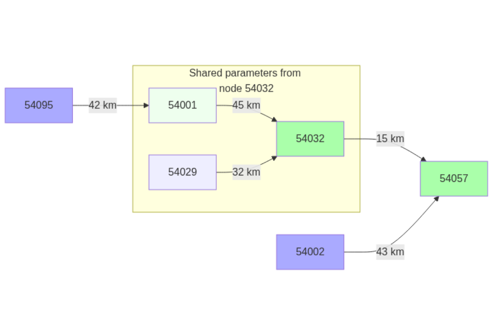
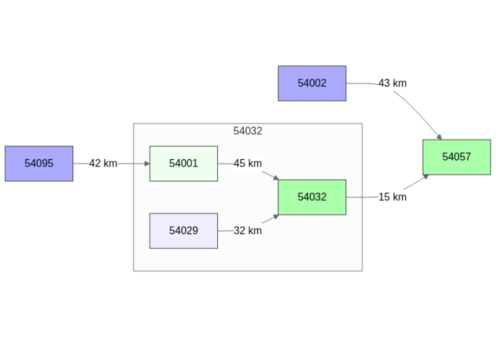
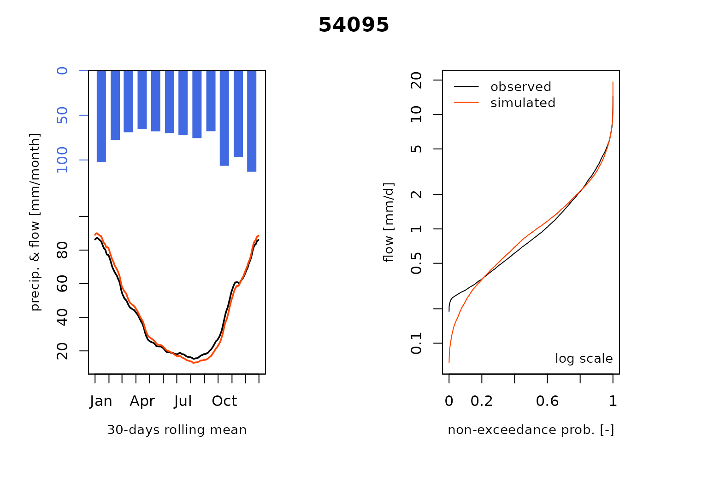
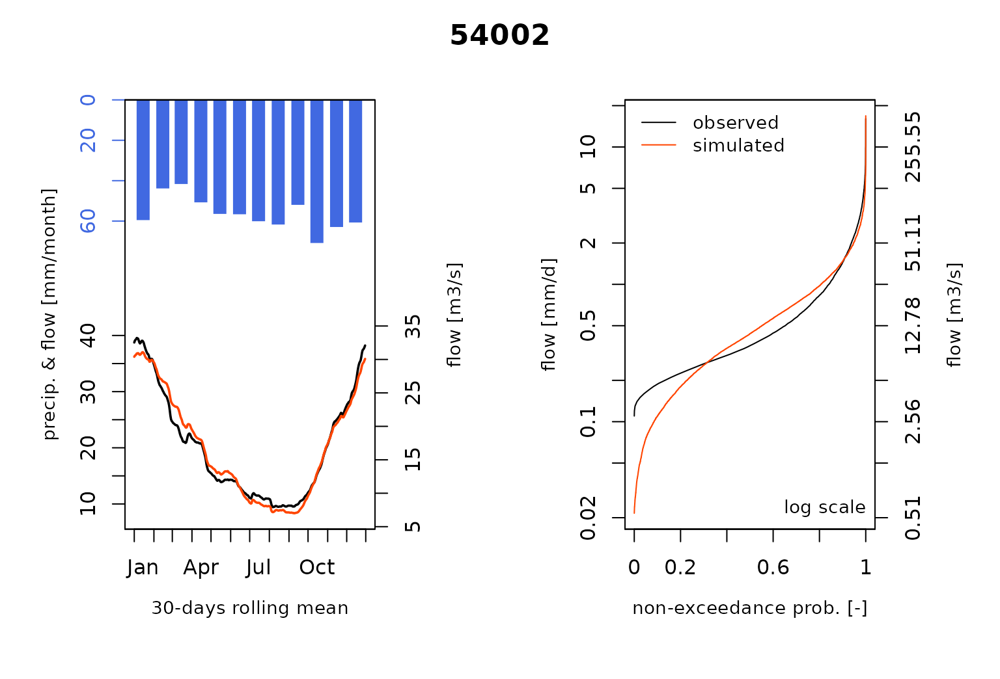
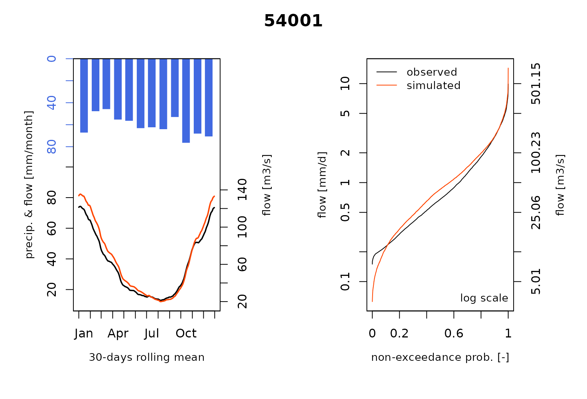
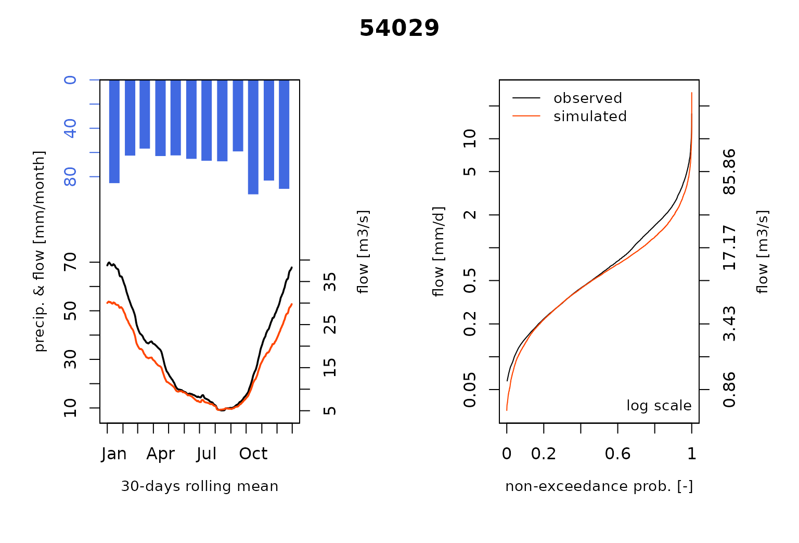
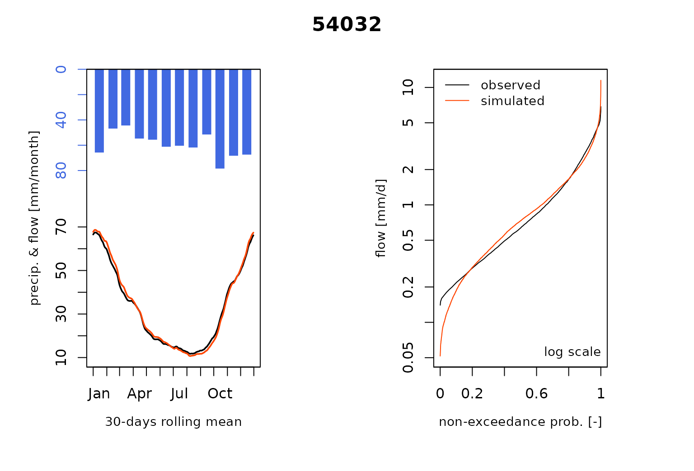
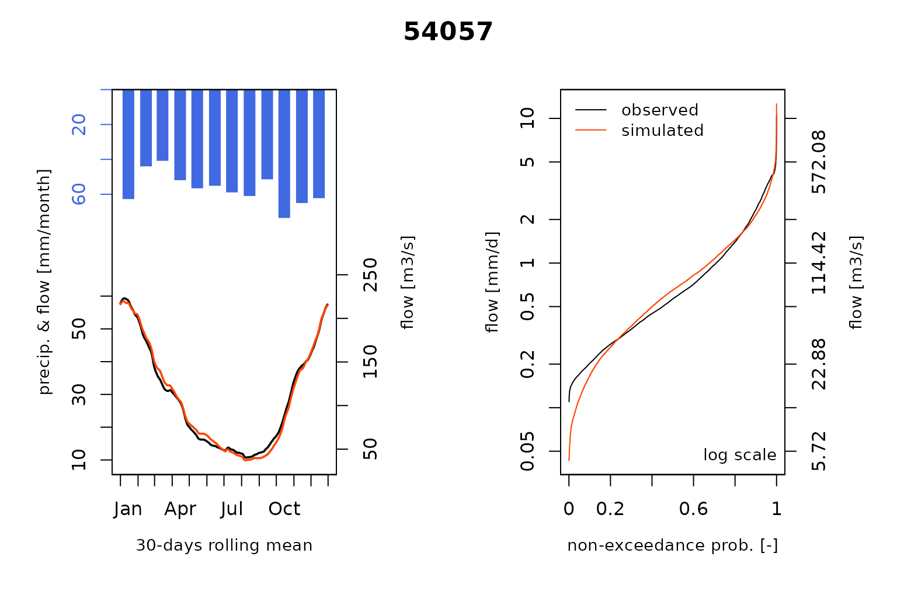

# Severn_05: Modeling ungauged stations

``` r
library(airGRiwrm)
#> Loading required package: airGR
#> 
#> Attaching package: 'airGRiwrm'
#> The following objects are masked from 'package:airGR':
#> 
#>     Calibration, CreateCalibOptions, CreateInputsCrit,
#>     CreateInputsModel, CreateRunOptions, RunModel
```

An *Ungauged* station is a virtual hydrometric station where no observed
flows are available for calibration.

### Why modeling *Ungauged* station in a semi-distributed model?

*Ungauged* nodes in a semi-distributed model can be used to reach two
different goals:

- increase spatial resolution of the rain fall to improve streamflow
  simulation (F. Lobligeois et al. 2014).
- simulate streamflows in location of interest for management purpose

This vignette introduces the implementation in airGRiwrm of the method
developed by Florent Lobligeois (2014) for calibrating *Ungauged* nodes
in a semi-distributed model.

### Presentation of the study case

Using the study case of the vignette \#1 and \#2, we consider this time
that nodes `54001` and `54029` are *Ungauged*. We simulate the
streamflow at these locations by sharing hydrological parameters of the
gauged node `54032`.



Hydrological parameters at the ungauged nodes will be the same as the
one at the gauged node `54032` except for the unit hydrograph parameter
which depend on the area of the sub-basin. Florent Lobligeois (2014)
provides the following conversion formula for this parameter:

$$x_{4i} = \left( \frac{S_{i}}{S_{BV}} \right)^{0.3}X_{4}$$ With $X_{4}$
the unit hydrograph parameter for the entire basin at `54032` which as
an area of $S_{BV}$; $S_{i}$ the area and $x_{4i}$ the parameter for the
sub-basin $i$.

### Using *Ungauged* stations in the airGRiwrm model

*Ungauged* stations are specified by using the model `"Ungauged"` in the
`model` column provided in the `CreateGRiwrm` function:

``` r
data(Severn)
nodes <- Severn$BasinsInfo[, c("gauge_id", "downstream_id", "distance_downstream", "area")]
nodes$model <- "RunModel_GR4J"
nodes$model[nodes$gauge_id %in% c("54029", "54001")] <- "Ungauged"
griwrmV05 <- CreateGRiwrm(
  nodes,
  list(id = "gauge_id", down = "downstream_id", length = "distance_downstream")
)
#> Ungauged node '54001' automatically gets the node '54032' as parameter donor
#> Ungauged node '54029' automatically gets the node '54032' as parameter donor
griwrmV05
#>      id  down length    area         model donor
#> 4 54095 54001     42 3722.68 RunModel_GR4J 54095
#> 5 54002 54057     43 2207.95 RunModel_GR4J 54002
#> 3 54001 54032     45 4329.90      Ungauged 54032
#> 6 54029 54032     32 1483.65      Ungauged 54032
#> 2 54032 54057     15 6864.88 RunModel_GR4J 54032
#> 1 54057  <NA>     NA 9885.46 RunModel_GR4J 54057
```

It should be noted that the `GRiwrm` object includes a column which
automatically define the first gauged station at downstream for each
*Ungauged* node. It is also possible to manually define the donor node
of an *Ungauged* node, which may be upstream or in a parallel sub-basin.
Type
[`?CreateGRiwrm`](https://inrae.github.io/airGRiwrm/dev/reference/CreateGRiwrm.md)
for more details.

On the following network scheme, the *Ungauged* nodes are clearer than
gauged ones with the same color (blue for upstream nodes and green for
intermediate and downstream nodes)

``` r
plot(griwrmV05)
```



### Generation of the GRiwrmInputsModel object

The formatting of the input data is described in the vignette
“V01_Structure_SD_model”. The following code chunk resumes this
formatting procedure:

``` r
BasinsObs <- Severn$BasinsObs
DatesR <- BasinsObs[[1]]$DatesR
PrecipTot <- cbind(sapply(BasinsObs, function(x) {x$precipitation}))
PotEvapTot <- cbind(sapply(BasinsObs, function(x) {x$peti}))
Precip <- ConvertMeteoSD(griwrmV05, PrecipTot)
PotEvap <- ConvertMeteoSD(griwrmV05, PotEvapTot)
```

Then, the `GRiwrmInputsModel` object can be generated taking into
account the new `GRiwrm` object:

``` r
IM_U <- CreateInputsModel(griwrmV05, DatesR, Precip, PotEvap)
#> CreateInputsModel.GRiwrm: Processing sub-basin 54095...
#> CreateInputsModel.GRiwrm: Processing sub-basin 54002...
#> CreateInputsModel.GRiwrm: Processing sub-basin 54001...
#> CreateInputsModel.GRiwrm: Processing sub-basin 54029...
#> CreateInputsModel.GRiwrm: Processing sub-basin 54032...
#> CreateInputsModel.GRiwrm: Processing sub-basin 54057...
```

### Calibration of the model integrating ungauged nodes

Calibration options is detailed in vignette “V02_Calibration_SD_model”.
We also apply a parameter regularization here but only where an upstream
simulated catchment is available.

The following code chunk resumes this procedure:

``` r
IndPeriod_Run <- seq(
  which(DatesR == (DatesR[1] + 365*24*60*60)), # Set aside warm-up period
  length(DatesR) # Until the end of the time series
)
IndPeriod_WarmUp = seq(1,IndPeriod_Run[1]-1)
RunOptions <- CreateRunOptions(IM_U,
                               IndPeriod_WarmUp = IndPeriod_WarmUp,
                               IndPeriod_Run = IndPeriod_Run)
Qobs <- cbind(sapply(BasinsObs, function(x) {x$discharge_spec}))
InputsCrit <- CreateInputsCrit(IM_U,
                               FUN_CRIT = ErrorCrit_KGE2,
                               RunOptions = RunOptions, Obs = Qobs[IndPeriod_Run,],
                               AprioriIds = c("54057" = "54032", "54032" = "54095"),
                               transfo = "sqrt", k = 0.15
)
CalibOptions <- CreateCalibOptions(IM_U)
```

The **airGR** calibration process is applied on each hydrological node
of the `GRiwrm` network from upstream nodes to downstream nodes but this
time the calibration of the sub-basin `54032` invokes a semi-distributed
model composed of the nodes `54029`, `54001` and `54032` sharing the
same parameters.

``` r
OC_U <- suppressWarnings(
  Calibration(IM_U, RunOptions, InputsCrit, CalibOptions))
#> Calibration.GRiwrmInputsModel: Processing sub-basin '54095'...
#> Grid-Screening in progress (0% 20% 40% 60% 80% 100%)
#>   Screening completed (81 runs)
#>       Param =  247.151,   -0.020,   83.096,    2.384
#>       Crit. KGE2[sqrt(Q)] = 0.9507
#> Steepest-descent local search in progress
#>   Calibration completed (37 iterations, 377 runs)
#>       Param =  305.633,    0.061,   48.777,    2.733
#>       Crit. KGE2[sqrt(Q)] = 0.9578
#> Calibration.GRiwrmInputsModel: Processing sub-basin '54002'...
#> Grid-Screening in progress (0% 20% 40% 60% 80% 100%)
#>   Screening completed (81 runs)
#>       Param =  432.681,   -0.020,   20.697,    1.944
#>       Crit. KGE2[sqrt(Q)] = 0.9264
#> Steepest-descent local search in progress
#>   Calibration completed (18 iterations, 209 runs)
#>       Param =  389.753,    0.085,   17.870,    2.098
#>       Crit. KGE2[sqrt(Q)] = 0.9370
#> Calibration.GRiwrmInputsModel: Processing sub-basins '54001', '54029', '54032' with '54032' as gauged donor...
#> Parameter regularization: get a priori parameters from node 54095: 1, 305.633, 0.061, 48.777, 1.871
#> Crit. KGE2[sqrt(Q)] = 0.9578
#>  SubCrit. KGE2[sqrt(Q)] cor(sim, obs, "pearson") = 0.9579 
#>  SubCrit. KGE2[sqrt(Q)] cv(sim)/cv(obs)          = 1.0023 
#>  SubCrit. KGE2[sqrt(Q)] mean(sim)/mean(obs)      = 1.0007 
#> 
#> Grid-Screening in progress (0% 20% 40% 60% 80% 100%)
#>   Screening completed (243 runs)
#>       Param =    1.250,  432.681,   -0.649,   20.697,    1.944
#>       Crit. Composite    = 0.9624
#> Steepest-descent local search in progress
#>   Calibration completed (23 iterations, 451 runs)
#>       Param =    1.125,  386.196,   -0.611,   31.536,    1.803
#>       Crit. Composite    = 0.9650
#>  Formula: sum(0.86 * KGE2[sqrt(Q)], 0.14 * GAPX[ParamT])
#> Tranferring parameters from node '54032' to node '54001'
#>       Param =    1.125,  386.196,   -0.611,   31.536,    1.529
#> 
#> Tranferring parameters from node '54032' to node '54029'
#>       Param =  386.196,   -0.611,   31.536,    1.999
#> 
#> Calibration.GRiwrmInputsModel: Processing sub-basin '54057'...
#> Parameter regularization: get a priori parameters from node 54032: 1.125, 386.196, -0.611, 31.536, 1.669
#> Crit. KGE2[sqrt(Q)] = 0.9660
#>  SubCrit. KGE2[sqrt(Q)] cor(sim, obs, "pearson") = 0.9664 
#>  SubCrit. KGE2[sqrt(Q)] cv(sim)/cv(obs)          = 1.0013 
#>  SubCrit. KGE2[sqrt(Q)] mean(sim)/mean(obs)      = 1.0050 
#> 
#> Grid-Screening in progress (0% 20% 40% 60% 80% 100%)
#>   Screening completed (243 runs)
#>       Param =    1.250,  432.681,   -0.649,   42.098,    1.944
#>       Crit. Composite    = 0.9609
#> Steepest-descent local search in progress
#>   Calibration completed (23 iterations, 450 runs)
#>       Param =    1.120,  383.753,   -0.613,   31.500,    1.671
#>       Crit. Composite    = 0.9647
#>  Formula: sum(0.85 * KGE2[sqrt(Q)], 0.15 * GAPX[ParamT])
```

Hydrological parameters for sub-basins

### Run the model with the optimized model parameters

The hydrological model uses parameters inherited from the calibration of
the gauged sub-basin `54032` for the *Ungauged* nodes `54001` and
`54029`:

``` r
ParamV05 <- sapply(griwrmV05$id, function(x) {OC_U[[x]]$Param})
dfParam <- do.call(
  rbind,
  lapply(ParamV05, function(x)
    if (length(x)==4) {return(c(NA, x))} else return(x))
)
colnames(dfParam) <- c("velocity", paste0("X", 1:4))
knitr::kable(round(dfParam, 3))
```

|       | velocity |      X1 |     X2 |     X3 |    X4 |
|:------|---------:|--------:|-------:|-------:|------:|
| 54095 |       NA | 305.633 |  0.061 | 48.777 | 2.733 |
| 54002 |       NA | 389.753 |  0.085 | 17.870 | 2.098 |
| 54001 |    1.125 | 386.196 | -0.611 | 31.536 | 1.529 |
| 54029 |       NA | 386.196 | -0.611 | 31.536 | 1.999 |
| 54032 |    1.125 | 386.196 | -0.611 | 31.536 | 1.803 |
| 54057 |    1.120 | 383.753 | -0.613 | 31.500 | 1.671 |

We can run the model with these calibrated parameters:

``` r
OutputsModels <- RunModel(
  IM_U,
  RunOptions = RunOptions,
  Param = ParamV05
)
#> RunModel.GRiwrmInputsModel: Processing sub-basin 54095...
#> RunModel.GRiwrmInputsModel: Processing sub-basin 54002...
#> RunModel.GRiwrmInputsModel: Processing sub-basin 54001...
#> RunModel.GRiwrmInputsModel: Processing sub-basin 54029...
#> RunModel.GRiwrmInputsModel: Processing sub-basin 54032...
#> RunModel.GRiwrmInputsModel: Processing sub-basin 54057...
```

and plot the comparison of the modeled and the observed flows including
the so-called *Ungauged* stations :

``` r
plot(OutputsModels, Qobs = Qobs[IndPeriod_Run,], which = c("Regime", "CumFreq"))
```



## References

Lobligeois, F., V. Andréassian, C. Perrin, P. Tabary, and C. Loumagne.
2014. “When Does Higher Spatial Resolution Rainfall Information Improve
Streamflow Simulation? An Evaluation Using 3620 Flood Events.”
*Hydrology and Earth System Sciences* 18 (2): 575–94.
<https://doi.org/10.5194/hess-18-575-2014>.

Lobligeois, Florent. 2014. “Mieux connaître la distribution spatiale des
pluies améliore-t-il la modélisation des crues ? Diagnostic sur 181
bassins versants français.” PhD thesis, AgroParisTech.
<https://pastel.hal.science/tel-01134990/document>.
