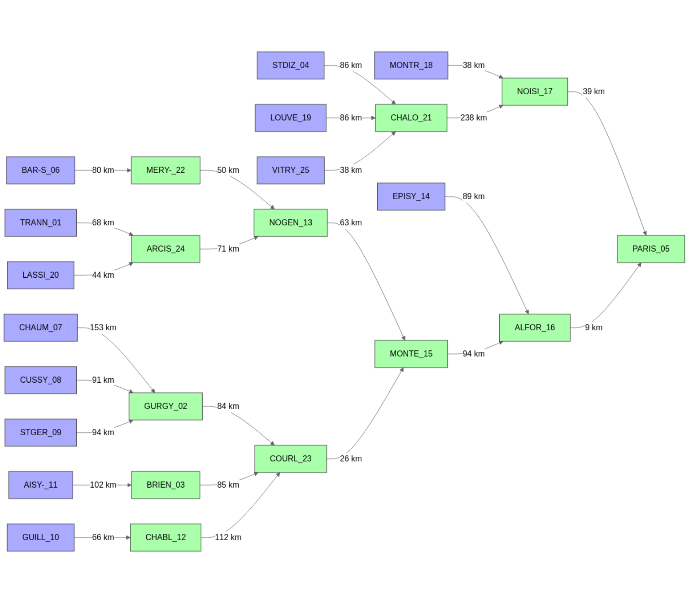

# Seine_01: Structuration of a semi-distributed GR4J model network

``` r

library(airGRiwrm)
```

    ## Loading required package: airGR

    ## 
    ## Attaching package: 'airGRiwrm'

    ## The following objects are masked from 'package:airGR':
    ## 
    ##     Calibration, CreateCalibOptions, CreateInputsCrit,
    ##     CreateInputsModel, CreateRunOptions, RunModel

The example below is inspired by the semi-distributed model developed in
the ClimAware project (Theobald et al. 2014), in which we used the daily
rainfall-runoff model GR4J.

The aim of this vignette is to create the semi-distributed network
necessary for the hydrological model.

### Semi-distributed network description

The model is distributed according to the gauging stations described in
Dorchies et al. (2014).

First, we must read the list of nodes and the associated metadata:

``` r

seine_nodes <- read.table(
  file = system.file("seine_data", "network_gauging_stations.txt", package = "seinebasin"),
  sep = ";", header = TRUE, fileEncoding = "UTF-8", quote = "\"", stringsAsFactors = FALSE
)
seine_nodes
```

    ##      id_sgl id_hydro lambert2.x lambert2.y     area
    ## 1  TRANN_01            766626.1    2369152  1557.06
    ## 2  GURGY_02 H2221010   689713.0    2320549  3819.77
    ## 3  BRIEN_03 H2482010   695313.0    2332549  2979.77
    ## 4  STDIZ_04 H5071010   791113.0    2407349  2347.53
    ## 5  PARIS_05 H5920010   602213.0    2427449 43824.66
    ## 6  BAR-S_06 H0400010   751913.0    2348349  2340.37
    ## 7  CHAUM_07            716518.4    2241747   216.50
    ## 8  CUSSY_08 H2172310   726013.0    2275149   247.99
    ## 9  STGER_09            718512.9    2266649   402.74
    ## 10 GUILL_10 H2322020   731013.0    2282349   488.71
    ## 11 AISY-_11 H2452020   742413.0    2298149  1349.51
    ## 12 CHABL_12 H2342010   709613.0    2314149  1116.27
    ## 13 NOGEN_13            685912.9    2389349  9182.39
    ## 14 EPISY_14 H3621010   633413.0    2371049  3916.71
    ## 15 MONTE_15            645112.9    2376849 21199.39
    ## 16 ALFOR_16 H4340020   606013.0    2420349 30784.71
    ## 17 NOISI_17 H5841010   620913.0    2428949 12547.72
    ## 18 MONTR_18 H5752020   638013.0    2431849  1184.81
    ## 19 LOUVE_19 H5083050   791613.0    2393949   461.74
    ## 20 LASSI_20 H1362010   759513.0    2385549   876.53
    ## 21 CHALO_21 H5201010   747713.0    2441349  6291.55
    ## 22 MERY-_22 H0810010   714913.0    2390949  3899.62
    ## 23 COURL_23 H2721010   660813.0    2370449 10687.35
    ## 24 ARCIS_24 H1501010   733313.0    2394749  3594.60
    ## 25 VITRY_25 H5172010   768513.0    2418849  2109.14
    ##                          description  id_aval distance_aval
    ## 1                   L'Aube à Trannes ARCIS_24         68100
    ## 2                    L'Yonne à Gurgy COURL_23         83612
    ## 3  L'Armançon à Brienon-sur-Armançon COURL_23         84653
    ## 4            La Marne à Saint-Dizier CHALO_21         85570
    ## 5                   La Seine à Paris                     NA
    ## 6           La Seine à Bar-sur-Seine MERY-_22         79766
    ## 7                 L'Yonne à Chaumard GURGY_02        153074
    ## 8       Le Cousin à Cussy-les-Forges GURGY_02         91378
    ## 9               La Cure à St-Germain GURGY_02         94152
    ## 10               Le Serein à Guillon CHABL_12         66026
    ## 11    L'Armançon à Aisy-sur-Armançon BRIEN_03        102428
    ## 12               Le Serein à Chablis COURL_23        111781
    ## 13       La Seine à Nogent-sur-Seine MONTE_15         63215
    ## 14                  Le Loing à Épisy ALFOR_16         89196
    ## 15              La Seine à Montereau ALFOR_16         94475
    ## 16            La Seine à Alfortville PARIS_05          9263
    ## 17                La Marne à Noisiel PARIS_05         39384
    ## 18           Le Grand Morin à Montry NOISI_17         37915
    ## 19             La Blaise à Louvemont CHALO_21         86165
    ## 20             La Voire à Lassicourt ARCIS_24         43618
    ## 21      La Marne à Châlons-sur-Marne NOISI_17        237937
    ## 22         La Seine à Méry-sur-Seine NOGEN_13         49933
    ## 23       L'Yonne à Courlon-sur-Yonne MONTE_15         26159
    ## 24           L'Aube à Arcis-sur-Aube NOGEN_13         70926
    ## 25      La Saulx à Vitry-en-Perthois CHALO_21         38047

Using that information, we must create the GRiwrm object that lists the
nodes and describes the network diagram. It is a dataframe of class
`GRiwrm` with specific column names:

- `id`: the identifier of the node in the network.
- `down`: the identifier of the next hydrological node downstream.
- `length`: hydraulic distance to the next hydrological downstream node.
- `model`: Name of the hydrological model used (E.g. “RunModel_GR4J”).
  `NA` for other types of nodes.
- `area`: Area of the sub-catchment (km²). Used for hydrological models
  such as GR models. `NA` if not used.

The `CreateGRiwrm` function helps to rename the columns of the dataframe
and assign the variable classes.

``` r

seine_nodes$id_aval[seine_nodes$id_aval == ""] <- NA
seine_nodes$distance_aval <- as.double(seine_nodes$distance_aval) / 1000
seine_nodes$model <- "RunModel_GR4J"
# Generate the GRiwrm object
griwrm <- CreateGRiwrm(seine_nodes,
                       list(id = "id_sgl",
                            down = "id_aval",
                            length = "distance_aval"))
griwrm
```

    ##          id     down  length     area         model    donor
    ## 1  TRANN_01 ARCIS_24  68.100  1557.06 RunModel_GR4J TRANN_01
    ## 4  STDIZ_04 CHALO_21  85.570  2347.53 RunModel_GR4J STDIZ_04
    ## 6  BAR-S_06 MERY-_22  79.766  2340.37 RunModel_GR4J BAR-S_06
    ## 7  CHAUM_07 GURGY_02 153.074   216.50 RunModel_GR4J CHAUM_07
    ## 8  CUSSY_08 GURGY_02  91.378   247.99 RunModel_GR4J CUSSY_08
    ## 9  STGER_09 GURGY_02  94.152   402.74 RunModel_GR4J STGER_09
    ## 10 GUILL_10 CHABL_12  66.026   488.71 RunModel_GR4J GUILL_10
    ## 11 AISY-_11 BRIEN_03 102.428  1349.51 RunModel_GR4J AISY-_11
    ## 14 EPISY_14 ALFOR_16  89.196  3916.71 RunModel_GR4J EPISY_14
    ## 18 MONTR_18 NOISI_17  37.915  1184.81 RunModel_GR4J MONTR_18
    ## 19 LOUVE_19 CHALO_21  86.165   461.74 RunModel_GR4J LOUVE_19
    ## 20 LASSI_20 ARCIS_24  43.618   876.53 RunModel_GR4J LASSI_20
    ## 25 VITRY_25 CHALO_21  38.047  2109.14 RunModel_GR4J VITRY_25
    ## 2  GURGY_02 COURL_23  83.612  3819.77 RunModel_GR4J GURGY_02
    ## 3  BRIEN_03 COURL_23  84.653  2979.77 RunModel_GR4J BRIEN_03
    ## 12 CHABL_12 COURL_23 111.781  1116.27 RunModel_GR4J CHABL_12
    ## 21 CHALO_21 NOISI_17 237.937  6291.55 RunModel_GR4J CHALO_21
    ## 22 MERY-_22 NOGEN_13  49.933  3899.62 RunModel_GR4J MERY-_22
    ## 24 ARCIS_24 NOGEN_13  70.926  3594.60 RunModel_GR4J ARCIS_24
    ## 13 NOGEN_13 MONTE_15  63.215  9182.39 RunModel_GR4J NOGEN_13
    ## 17 NOISI_17 PARIS_05  39.384 12547.72 RunModel_GR4J NOISI_17
    ## 23 COURL_23 MONTE_15  26.159 10687.35 RunModel_GR4J COURL_23
    ## 15 MONTE_15 ALFOR_16  94.475 21199.39 RunModel_GR4J MONTE_15
    ## 16 ALFOR_16 PARIS_05   9.263 30784.71 RunModel_GR4J ALFOR_16
    ## 5  PARIS_05     <NA>      NA 43824.66 RunModel_GR4J PARIS_05

The diagram of the network structure is represented below with in blue
the upstream nodes with a GR4J model and in green the intermediate nodes
with an SD (GR4J + LAG) model.

``` r

plot(griwrm)
```



### Observation time series

The daily mean precipitation and potential evaporation at the scale of
the intermediate sub-basins are extracted from the SAFRAN reanalysis
(Vidal et al. 2010).

The daily naturalized flow is provided by Hydratec (2011).

These data are embedded in the R package ‘seinebasin’, which is not
publicly available.

``` r

library(seinebasin)
data(QNAT)
```

### Generate the GRiwrm InputsModel object

The GRiwrm InputsModel object is a list of **airGR** InputsModel
objects. The identifier of the sub-basin is used as a key in the list,
which is ordered from upstream to downstream.

The **airGR** CreateInputsModel function is extended in order to handle
the GRiwrm object that describes the basin diagram:

``` r

InputsModel <- CreateInputsModel(griwrm, DatesR, Precip, PotEvap)
```

    ## CreateInputsModel.GRiwrm: Processing sub-basin TRANN_01...

    ## CreateInputsModel.GRiwrm: Processing sub-basin STDIZ_04...

    ## CreateInputsModel.GRiwrm: Processing sub-basin BAR-S_06...

    ## CreateInputsModel.GRiwrm: Processing sub-basin CHAUM_07...

    ## CreateInputsModel.GRiwrm: Processing sub-basin CUSSY_08...

    ## CreateInputsModel.GRiwrm: Processing sub-basin STGER_09...

    ## CreateInputsModel.GRiwrm: Processing sub-basin GUILL_10...

    ## CreateInputsModel.GRiwrm: Processing sub-basin AISY-_11...

    ## CreateInputsModel.GRiwrm: Processing sub-basin EPISY_14...

    ## CreateInputsModel.GRiwrm: Processing sub-basin MONTR_18...

    ## CreateInputsModel.GRiwrm: Processing sub-basin LOUVE_19...

    ## CreateInputsModel.GRiwrm: Processing sub-basin LASSI_20...

    ## CreateInputsModel.GRiwrm: Processing sub-basin VITRY_25...

    ## CreateInputsModel.GRiwrm: Processing sub-basin GURGY_02...

    ## CreateInputsModel.GRiwrm: Processing sub-basin BRIEN_03...

    ## CreateInputsModel.GRiwrm: Processing sub-basin CHABL_12...

    ## CreateInputsModel.GRiwrm: Processing sub-basin CHALO_21...

    ## CreateInputsModel.GRiwrm: Processing sub-basin MERY-_22...

    ## CreateInputsModel.GRiwrm: Processing sub-basin ARCIS_24...

    ## CreateInputsModel.GRiwrm: Processing sub-basin NOGEN_13...

    ## CreateInputsModel.GRiwrm: Processing sub-basin NOISI_17...

    ## CreateInputsModel.GRiwrm: Processing sub-basin COURL_23...

    ## CreateInputsModel.GRiwrm: Processing sub-basin MONTE_15...

    ## CreateInputsModel.GRiwrm: Processing sub-basin ALFOR_16...

    ## CreateInputsModel.GRiwrm: Processing sub-basin PARIS_05...

### Save data for next vignettes

``` r

dir.create("_cache", showWarnings = FALSE)
save(seine_nodes, griwrm, InputsModel, file = "_cache/V01.RData")
```

## References

Dorchies, David, Guillaume Thirel, Maxime Jay-Allemand, et al. 2014.
“Climate Change Impacts on Multi-Objective Reservoir Management: Case
Study on the Seine River Basin, France.” *International Journal of River
Basin Management* 12 (3): 265–83.
<https://doi.org/10.1080/15715124.2013.865636>.

Hydratec. 2011. *Actualisation de La Base de Données Des Débits
Journaliers “Naturalisés” - Phase 2.* 26895 - LME/TL.

Theobald, S., K. Träbing, K. Kehr, et al. 2014. *ClimAware: Impacts of
Climate Change on Water Resources Management. Regional Strategies and
European View. Final Report*.
<http://irsteadoc.irstea.fr/cemoa/PUB00040932>.

Vidal, Jean-Philippe, Eric Martin, Laurent Franchistéguy, Martine
Baillon, and Jean-Michel Soubeyroux. 2010. “A 50-Year High-Resolution
Atmospheric Reanalysis over France with the Safran System.”
*International Journal of Climatology* 30 (11): 1627–44.
<https://doi.org/10.1002/joc.2003>.
