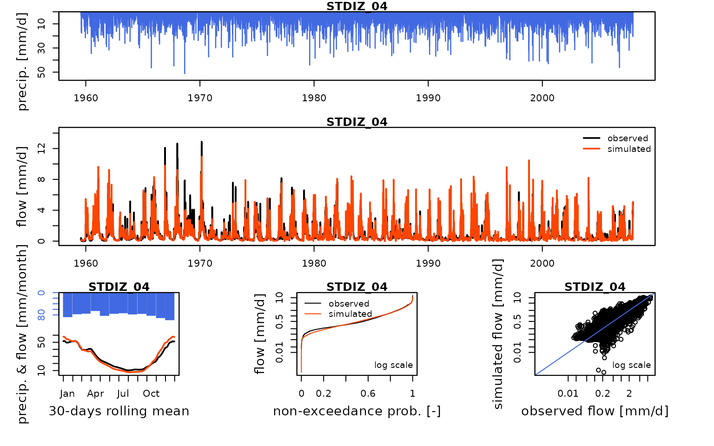
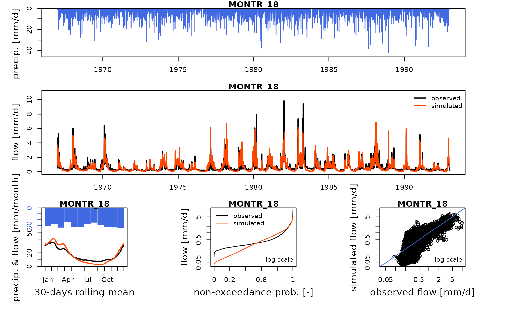
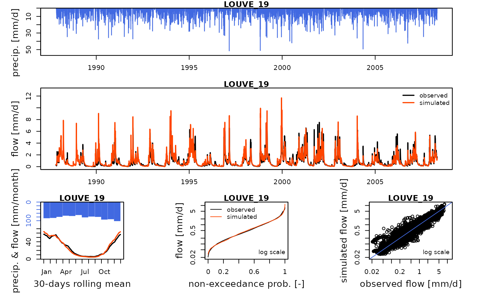
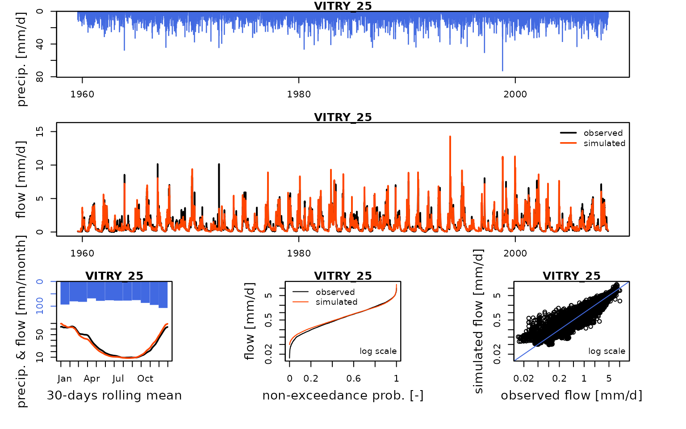
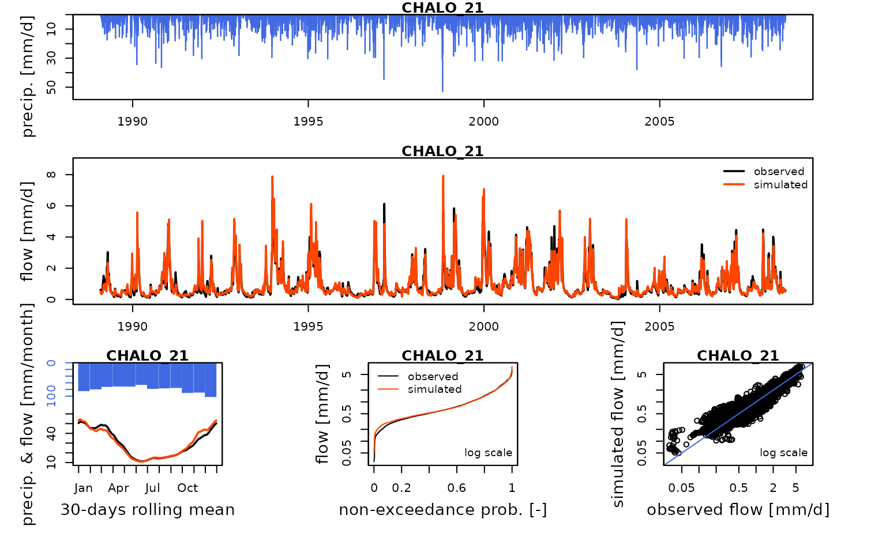
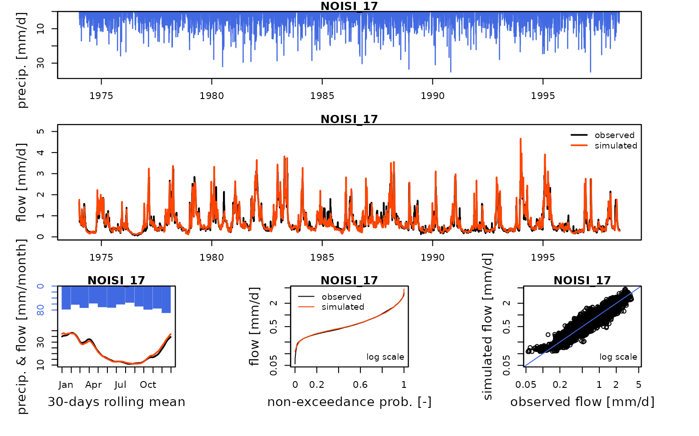

# Seine_05b: Calibration of an open-loop influenced flow semi-distributed GR6J model network

``` r
library(airGRiwrm)
#> Loading required package: airGR
#> 
#> Attaching package: 'airGRiwrm'
#> The following objects are masked from 'package:airGR':
#> 
#>     Calibration, CreateCalibOptions, CreateInputsCrit,
#>     CreateInputsModel, CreateRunOptions, RunModel
```

As in vignette V05, this vignette proposes an example of calibration of
influenced flow with the Marne reservoir but here with the GR6J model
instead of GR4J. It will use influenced observation flows directly
measured at gauging stations and flows recorded at reservoir inlets and
outlets.

## Set the data

Loading naturalized data and influenced flow configuration:

``` r
#load("_cache/V01.RData")
load("_cache/V04.RData")
```

We remove extra items from a complete configuration to keep only the
Marne system:

``` r
selectedNodes <- c("MARNE_P23", "STDIZ_04", "LOUVE_19", "VITRY_25", "MARNE_P28", "MARNE_R25", "CHALO_21", "MONTR_18", "NOISI_17")
griwrm3 <- griwrm2[griwrm2$id %in% selectedNodes,]
griwrm3$model[!is.na(griwrm3$model)] <- "RunModel_GR6J"
griwrm3[griwrm3$id == "NOISI_17", c("down", "length")] = NA # Downstream station instead of PARIS_05
plot(griwrm3)
#> Warning in utils::download.file(link, file.dest, quiet = TRUE, mode = "wb"):
#> downloaded length 0 != reported length 21
#> Warning in utils::download.file(link, file.dest, quiet = TRUE, mode = "wb"):
#> cannot open URL
#> 'https://mermaid.ink/img/pako:eNrNVU1PwkAU_CubGsKlJNL6UXswMWK0CYIpYKLVNBv6FlbbQtpFTYD_7gp9dbuCBE9emtfM7LyZ2SadG8NJBIZr1GpznnLhknldjCGBukvqKcxERuP6kixrtaf0KR1ldDombf9r5lHY67e8x_DwKMDhuQBuu52-HzadAAcE2t3B_VXYPAtwQODe6_sPoXUc4IDA5c1FuxtazQAHBDpdr-eFzdMAh-d_7er2wu9chXeWHZSTDjkl5FQhXzooJz0maTTOF8Q5Ia_JgijWtNBrmu0gDf1pFexQwx50NY2Gr2uatXVrWUWhhzTMphdUuLO2ZcWO1rzj0028YUzzXF1iKgRT8Ui8VECWQMSpgGs6G0FUOY_Nmkp9ptrRYJqLDGiy6SwGN9V4ZiVDi2cwFF76Ip98kpbnW8BIBIzOYkHkgskruAe2bVdwXD1IR6vlhPE4dg8A2EbatUqitEpSa9D1GGylVjUZrRB9yCF7m_CswM-iqpCWvWAxSn9N2eJvkOXffBnXLCuSh_Gl8c4jMXbt6ccvbehispZ9xDa19sMfg79KbvHI6D6C5S3oOvI6dugYppFIM5RHhjs3Vn8M-RMpPktjufwEFnwn1Q?type=png':
#> HTTP status was '500 Internal Server Error'
#> Warning in plot.mermaid(diagram, ...): Mermaid diagram generation failed with error:
#> cannot open URL 'https://mermaid.ink/img/pako:eNrNVU1PwkAU_CubGsKlJNL6UXswMWK0CYIpYKLVNBv6FlbbQtpFTYD_7gp9dbuCBE9emtfM7LyZ2SadG8NJBIZr1GpznnLhknldjCGBukvqKcxERuP6kixrtaf0KR1ldDombf9r5lHY67e8x_DwKMDhuQBuu52-HzadAAcE2t3B_VXYPAtwQODe6_sPoXUc4IDA5c1FuxtazQAHBDpdr-eFzdMAh-d_7er2wu9chXeWHZSTDjkl5FQhXzooJz0maTTOF8Q5Ia_JgijWtNBrmu0gDf1pFexQwx50NY2Gr2uatXVrWUWhhzTMphdUuLO2ZcWO1rzj0028YUzzXF1iKgRT8Ui8VECWQMSpgGs6G0FUOY_Nmkp9ptrRYJqLDGiy6SwGN9V4ZiVDi2cwFF76Ip98kpbnW8BIBIzOYkHkgskruAe2bVdwXD1IR6vlhPE4dg8A2EbatUqitEpSa9D1GGylVjUZrRB9yCF7m_CswM-iqpCWvWAxSn9N2eJvkOXffBnXLCuSh_Gl8c4jMXbt6ccvbehispZ9xDa19sMfg79KbvHI6D6C5S3oOvI6dugYppFIM5RHhjs3Vn8M-RMpPktjufwEFnwn1Q?type=png'
```

We can now generate the new `GRiwrmInputsModel` object:

``` r
library(seinebasin)
data(QOBS)
iEnd <- which(DatesR == as.POSIXct("2008-07-31", tz = "UTC"))

data(Qreservoirs)
QresMarne <- Qreservoirs[1:iEnd, grep("MARNE", colnames(Qreservoirs))]
id_GR_nodes <- griwrm3$id[!is.na(griwrm3$model)]
InputsModel3 <- CreateInputsModel(griwrm3,
                                  DatesR[1:iEnd],
                                  Precip[1:iEnd, id_GR_nodes],
                                  PotEvap[1:iEnd, id_GR_nodes],
                                  QresMarne)
#> CreateInputsModel.GRiwrm: Processing sub-basin STDIZ_04...
#> CreateInputsModel.GRiwrm: Processing sub-basin MONTR_18...
#> CreateInputsModel.GRiwrm: Processing sub-basin LOUVE_19...
#> CreateInputsModel.GRiwrm: Processing sub-basin VITRY_25...
#> CreateInputsModel.GRiwrm: Processing sub-basin CHALO_21...
#> CreateInputsModel.GRiwrm: Processing sub-basin NOISI_17...
```

## GriwmRunOptions object

We first define the run period:

``` r
IndPeriod_Run <- seq.int(
  which(DatesR == (DatesR[1] + 365 * 24 * 60 * 60)), # Set aside warm-up period
  iEnd # Until the end of the time series
)
```

We define the (optional but recommended) warm up period as a one-year
period before the run period:

``` r
IndPeriod_WarmUp <- seq.int(1,IndPeriod_Run[1] - 1)
```

``` r
RunOptions <- CreateRunOptions(
  InputsModel3,
  IndPeriod_WarmUp = IndPeriod_WarmUp,
  IndPeriod_Run = IndPeriod_Run
)
```

## InputsCrit object

We define the objective function for the calibration:

``` r
InputsCrit <- CreateInputsCrit(
  InputsModel = InputsModel3,
  FUN_CRIT = ErrorCrit_KGE2,
  RunOptions = RunOptions, Obs = Qobs[IndPeriod_Run,]
)
```

## GRiwrmCalibOptions object

``` r
CalibOptions <- CreateCalibOptions(InputsModel3)
str(CalibOptions)
#> List of 6
#>  $ STDIZ_04:List of 4
#>   ..$ FixedParam       : logi [1:7] NA NA NA NA NA NA ...
#>   ..$ SearchRanges     : num [1:2, 1:7] 1.00e-02 2.00e+01 4.59e-05 2.18e+04 -1.09e+04 ...
#>   ..$ FUN_TRANSFO      :function (ParamIn, Direction)  
#>   ..$ StartParamDistrib: num [1:3, 1:7] 1.25 2.5 5 36.6 49.4 ...
#>   ..- attr(*, "class")= chr [1:5] "CalibOptions" "daily" "GR" "SD" ...
#>  $ MONTR_18:List of 4
#>   ..$ FixedParam       : logi [1:6] NA NA NA NA NA NA
#>   ..$ SearchRanges     : num [1:2, 1:6] 4.59e-05 2.18e+04 -1.09e+04 1.09e+04 4.59e-05 ...
#>   ..$ FUN_TRANSFO      :function (ParamIn, Direction)  
#>   ..$ StartParamDistrib: num [1:3, 1:6] 36.598 49.402 90.017 -1.175 -0.521 ...
#>   ..- attr(*, "class")= chr [1:4] "CalibOptions" "daily" "GR" "HBAN"
#>  $ LOUVE_19:List of 4
#>   ..$ FixedParam       : logi [1:6] NA NA NA NA NA NA
#>   ..$ SearchRanges     : num [1:2, 1:6] 4.59e-05 2.18e+04 -1.09e+04 1.09e+04 4.59e-05 ...
#>   ..$ FUN_TRANSFO      :function (ParamIn, Direction)  
#>   ..$ StartParamDistrib: num [1:3, 1:6] 36.598 49.402 90.017 -1.175 -0.521 ...
#>   ..- attr(*, "class")= chr [1:4] "CalibOptions" "daily" "GR" "HBAN"
#>  $ VITRY_25:List of 4
#>   ..$ FixedParam       : logi [1:6] NA NA NA NA NA NA
#>   ..$ SearchRanges     : num [1:2, 1:6] 4.59e-05 2.18e+04 -1.09e+04 1.09e+04 4.59e-05 ...
#>   ..$ FUN_TRANSFO      :function (ParamIn, Direction)  
#>   ..$ StartParamDistrib: num [1:3, 1:6] 36.598 49.402 90.017 -1.175 -0.521 ...
#>   ..- attr(*, "class")= chr [1:4] "CalibOptions" "daily" "GR" "HBAN"
#>  $ CHALO_21:List of 4
#>   ..$ FixedParam       : logi [1:7] NA NA NA NA NA NA ...
#>   ..$ SearchRanges     : num [1:2, 1:7] 1.00e-02 2.00e+01 4.59e-05 2.18e+04 -1.09e+04 ...
#>   ..$ FUN_TRANSFO      :function (ParamIn, Direction)  
#>   ..$ StartParamDistrib: num [1:3, 1:7] 1.25 2.5 5 36.6 49.4 ...
#>   ..- attr(*, "class")= chr [1:5] "CalibOptions" "daily" "GR" "SD" ...
#>  $ NOISI_17:List of 4
#>   ..$ FixedParam       : logi [1:7] NA NA NA NA NA NA ...
#>   ..$ SearchRanges     : num [1:2, 1:7] 1.00e-02 2.00e+01 4.59e-05 2.18e+04 -1.09e+04 ...
#>   ..$ FUN_TRANSFO      :function (ParamIn, Direction)  
#>   ..$ StartParamDistrib: num [1:3, 1:7] 1.25 2.5 5 36.6 49.4 ...
#>   ..- attr(*, "class")= chr [1:5] "CalibOptions" "daily" "GR" "SD" ...
#>  - attr(*, "class")= chr [1:2] "GRiwrmCalibOptions" "list"
```

## Calibration

The optimization (i.e. calibration) of parameters can now be performed:

``` r
OutputsCalib <- Calibration(InputsModel3, RunOptions, InputsCrit, CalibOptions)
#> Calibration.GRiwrmInputsModel: Processing sub-basin 'STDIZ_04'...
#> Grid-Screening in progress (0% 20% 40% 60% 80% 100%)
#>   Screening completed (2187 runs)
#>       Param =    5.000,   36.598,   -0.521,   60.340,    2.345,    0.220,   20.086
#>       Crit. KGE2[Q]      = 0.8026
#> Steepest-descent local search in progress
#>   Calibration completed (189 iterations, 4832 runs)
#>       Param =   19.990,  161.029,   -0.101,   46.805,    3.720,    0.287,    3.717
#>       Crit. KGE2[Q]      = 0.9193
#> Calibration.GRiwrmInputsModel: Processing sub-basin 'MONTR_18'...
#> Grid-Screening in progress (0% 20% 40% 60% 80% 100%)
#>   Screening completed (729 runs)
#>       Param =   90.017,   -0.521,   60.340,    2.345,    0.220,   20.086
#>       Crit. KGE2[Q]      = 0.7904
#> Steepest-descent local search in progress
#>   Calibration completed (79 iterations, 1699 runs)
#>       Param =  175.611,   -0.318,   46.474,    2.412,    0.272,    6.006
#>       Crit. KGE2[Q]      = 0.8382
#> Calibration.GRiwrmInputsModel: Processing sub-basin 'LOUVE_19'...
#> Grid-Screening in progress (0% 20% 40% 60% 80% 100%)
#>   Screening completed (729 runs)
#>       Param =   49.402,   -0.521,   60.340,    2.345,    0.020,   20.086
#>       Crit. KGE2[Q]      = 0.9127
#> Steepest-descent local search in progress
#>   Calibration completed (33 iterations, 1099 runs)
#>       Param =   58.518,   -0.521,   94.421,    2.221,    0.026,   14.515
#>       Crit. KGE2[Q]      = 0.9290
#> Calibration.GRiwrmInputsModel: Processing sub-basin 'VITRY_25'...
#> Grid-Screening in progress (0% 20% 40% 60% 80% 100%)
#>   Screening completed (729 runs)
#>       Param =   36.598,   -0.521,  148.413,    2.345,    0.020,   20.086
#>       Crit. KGE2[Q]      = 0.9197
#> Steepest-descent local search in progress
#>   Calibration completed (56 iterations, 1394 runs)
#>       Param =   33.665,   -0.521,  163.534,    3.691,    0.043,   16.471
#>       Crit. KGE2[Q]      = 0.9473
#> Calibration.GRiwrmInputsModel: Processing sub-basin 'CHALO_21'...
#> Parameter regularization: test a priori parameters from node STDIZ_04: 19.99, 161.029, -0.101, 46.805, 3.167, 0.287, 3.717
#> Crit. KGE2[Q] = 0.7799
#>  SubCrit. KGE2[Q] cor(sim, obs, "pearson") = 0.9017 
#>  SubCrit. KGE2[Q] cv(sim)/cv(obs)          = 1.0898 
#>  SubCrit. KGE2[Q] mean(sim)/mean(obs)      = 1.1753 
#> 
#> Parameter regularization: test a priori parameters from node LOUVE_19: 1, 58.518, -0.521, 94.421, 3.079, 0.026, 14.515
#> Crit. KGE2[Q] = 0.8506
#>  SubCrit. KGE2[Q] cor(sim, obs, "pearson") = 0.9347 
#>  SubCrit. KGE2[Q] cv(sim)/cv(obs)          = 1.0801 
#>  SubCrit. KGE2[Q] mean(sim)/mean(obs)      = 1.1079 
#> 
#> Parameter regularization: test a priori parameters from node VITRY_25: 1, 33.665, -0.521, 163.534, 3.245, 0.043, 16.471
#> Crit. KGE2[Q] = 0.8474
#>  SubCrit. KGE2[Q] cor(sim, obs, "pearson") = 0.9383 
#>  SubCrit. KGE2[Q] cv(sim)/cv(obs)          = 1.0519 
#>  SubCrit. KGE2[Q] mean(sim)/mean(obs)      = 1.1295 
#> 
#> Parameter regularization: set a priori parameters from node LOUVE_19: 1, 58.518, -0.521, 94.421, 3.079, 0.026, 14.515
#> Grid-Screening in progress (0% 20% 40% 60% 80% 100%)
#>   Screening completed (2187 runs)
#>       Param =    1.250,   90.017,   -1.175,  148.413,    2.345,    0.020,   20.086
#>       Crit. Composite    = 0.9445
#> Steepest-descent local search in progress
#>   Calibration completed (45 iterations, 2783 runs)
#>       Param =    0.600,  164.019,   -1.008,  205.622,    3.061,   -0.027,   17.236
#>       Crit. Composite    = 0.9538
#>  Formula: sum(0.87 * KGE2[sqrt(Q)], 0.13 * GAPX[ParamT])
#> Calibration.GRiwrmInputsModel: Processing sub-basin 'NOISI_17'...
#> Parameter regularization: test a priori parameters from node MONTR_18: 1, 175.611, -0.318, 46.474, 3.731, 0.272, 6.006
#> Crit. KGE2[Q] = 0.6518
#>  SubCrit. KGE2[Q] cor(sim, obs, "pearson") = 0.9340 
#>  SubCrit. KGE2[Q] cv(sim)/cv(obs)          = 1.2691 
#>  SubCrit. KGE2[Q] mean(sim)/mean(obs)      = 1.2108 
#> 
#> Parameter regularization: test a priori parameters from node CHALO_21: 0.6, 164.019, -1.008, 205.622, 4.53, -0.027, 17.236
#> Crit. KGE2[Q] = 0.7556
#>  SubCrit. KGE2[Q] cor(sim, obs, "pearson") = 0.9343 
#>  SubCrit. KGE2[Q] cv(sim)/cv(obs)          = 1.2189 
#>  SubCrit. KGE2[Q] mean(sim)/mean(obs)      = 0.9135 
#> 
#> Parameter regularization: set a priori parameters from node CHALO_21: 0.6, 164.019, -1.008, 205.622, 4.53, -0.027, 17.236
#> Grid-Screening in progress (0% 20% 40% 60% 80% 100%)
#>   Screening completed (2187 runs)
#>       Param =    1.250,   90.017,   -1.175,  148.413,    2.345,    0.220,  148.413
#>       Crit. Composite    = 0.8743
#> Steepest-descent local search in progress
#>   Calibration completed (93 iterations, 3496 runs)
#>       Param =    1.157,  570.028,   -1.382,  366.676,    4.142,    0.190,   29.799
#>       Crit. Composite    = 0.9488
#>  Formula: sum(0.88 * KGE2[sqrt(Q)], 0.12 * GAPX[ParamT])
```

## Run model with Michel calibration

Now that the model is calibrated, we can run it with the optimized
parameter values:

``` r
Param5 <- extractParam(OutputsCalib)

OutputsModels3 <- RunModel(
  InputsModel3,
  RunOptions = RunOptions,
  Param = Param5
)
#> RunModel.GRiwrmInputsModel: Processing sub-basin STDIZ_04...
#> Warning in RunModel_Lag(InputsModel, RunOptions, Param[1], OutputsModel): 123
#> time steps with negative flow, set to zero.
#> RunModel.GRiwrmInputsModel: Processing sub-basin MONTR_18...
#> RunModel.GRiwrmInputsModel: Processing sub-basin LOUVE_19...
#> RunModel.GRiwrmInputsModel: Processing sub-basin VITRY_25...
#> RunModel.GRiwrmInputsModel: Processing sub-basin CHALO_21...
#> RunModel.GRiwrmInputsModel: Processing sub-basin NOISI_17...
```

### Comparison with simulated flows

We can compare these simulated flows with influenced discharge
measurements:

``` r
htmltools::tagList(lapply(
  griwrm3$id[!is.na(griwrm3$model)],
  function(x) {
    Q3 <- Qobs[RunOptions[[1]]$IndPeriod_Run, x]
    iQ3 <- which(!is.na(Q3))
    IndPeriod_Obs <- iQ3[1]:tail(iQ3, 1)
    OutputsModels <- ReduceOutputsModel(OutputsModels3[[x]], IndPeriod_Obs)
    plot(OutputsModels, Qobs = Q3[IndPeriod_Obs], main = x)
  }
))
#> Warning in plot.OutputsModel(OutputsModels, Qobs = Q3[IndPeriod_Obs], main =
#> x): zeroes detected in 'Qsim': some plots in the log space will not be created
#> using all time-steps
```


