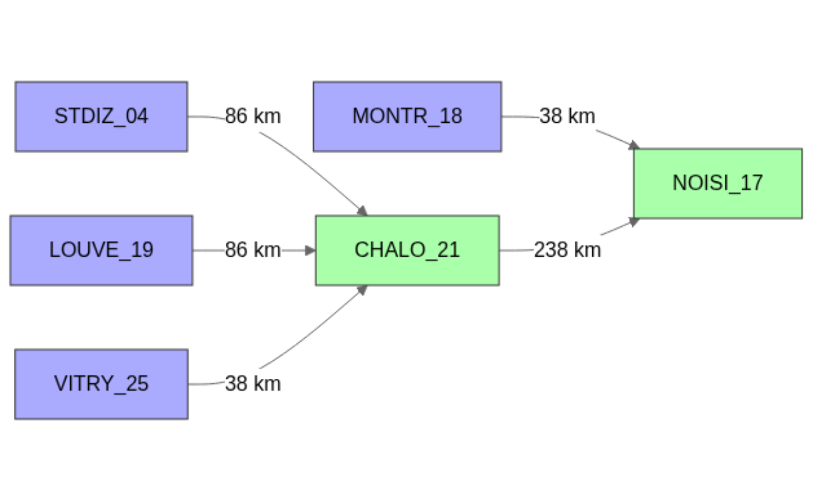
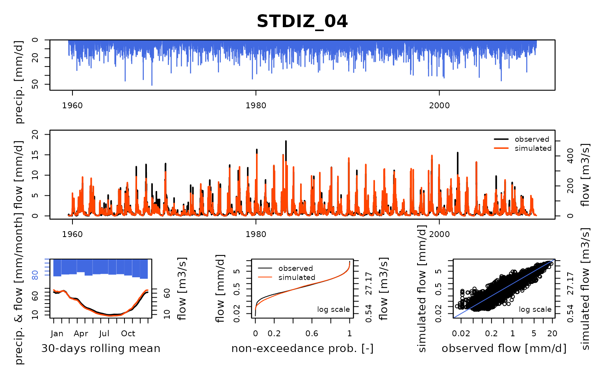
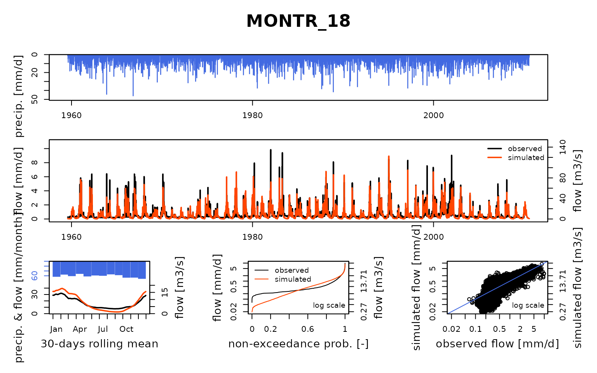
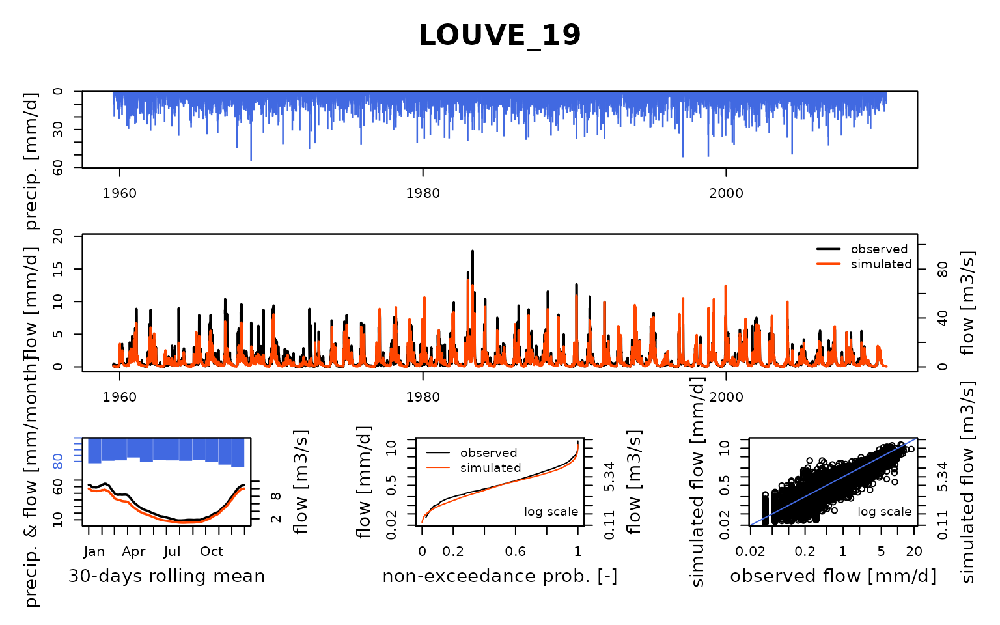
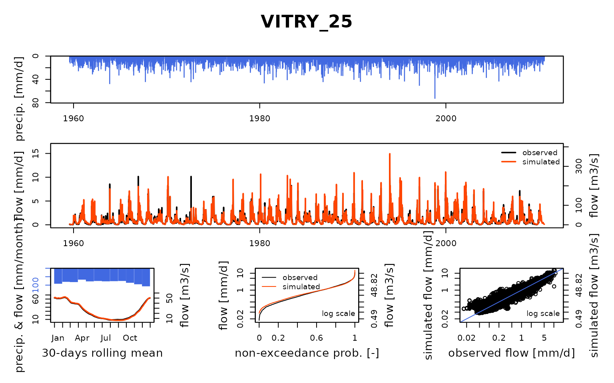
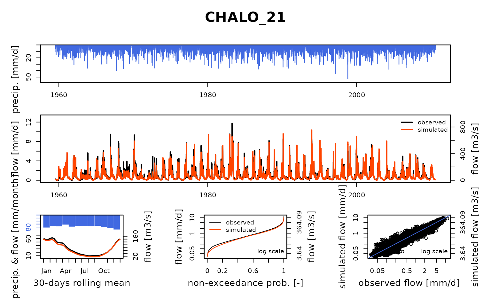
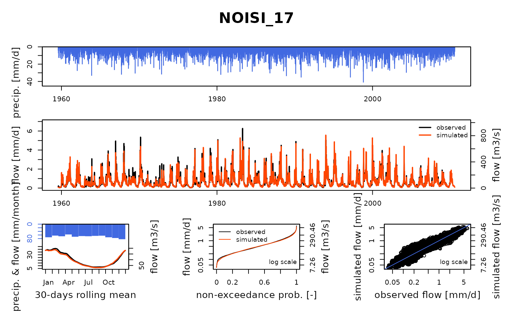

# Seine_06: Simulate naturalized flows with a model network calibrated with influenced flows

``` r
library(airGRiwrm)
#> Loading required package: airGR
#> 
#> Attaching package: 'airGRiwrm'
#> The following objects are masked from 'package:airGR':
#> 
#>     Calibration, CreateCalibOptions, CreateInputsCrit,
#>     CreateInputsModel, CreateRunOptions, RunModel
library(seinebasin)
```

This vignette aims at showing an example of flow naturalization by
modeling (Terrier et al. 2020).

By using the model calibrated with influenced flows on the Marne River,
it is now possible to model naturalized flows by dropping the
connections to the Marne reservoir from the model. Please note that this
is not the only way to remove the influence of reservoirs.

### Set the data

We first load the naturalized data and influenced flow calibrated
parameters (for GR4J, see
`vignette("V05_Open-loop_influenced_flow_calibration", package = "airGRiwrm")`):

``` r
# Input data for the model
load("_cache/V01.RData")
# Calibration in influenced flows
load("_cache/V05.RData")
```

We must remove the lag parameter in the `STDIZ_04` station because there
is no longer upstream node on it since we remove the only upstream
element for this station, a reservoir uptake:

``` r
Param6 <- Param5
Param6$STDIZ_04 <- Param6$STDIZ_04[-1]
```

We remove extra items from a complete configuration to keep only the
Marne system:

``` r
selectedNodes <- c("STDIZ_04", "LOUVE_19", "VITRY_25", "CHALO_21", "MONTR_18", "NOISI_17")
griwrm4 <- griwrm[griwrm$id %in% selectedNodes,]
griwrm4[griwrm4$id == "NOISI_17", c("down", "length")] = NA # Downstream station instead of PARIS_05
plot(griwrm4)
```



We can now generate the new `GRiwrmInputsModel` object:

``` r
data(QNAT)
InputsModel4 <- CreateInputsModel(griwrm4,
                                  DatesR,
                                  Precip[, selectedNodes],
                                  PotEvap[, selectedNodes])
#> CreateInputsModel.GRiwrm: Processing sub-basin STDIZ_04...
#> CreateInputsModel.GRiwrm: Processing sub-basin MONTR_18...
#> CreateInputsModel.GRiwrm: Processing sub-basin LOUVE_19...
#> CreateInputsModel.GRiwrm: Processing sub-basin VITRY_25...
#> CreateInputsModel.GRiwrm: Processing sub-basin CHALO_21...
#> CreateInputsModel.GRiwrm: Processing sub-basin NOISI_17...
```

### GriwmRunOptions object

We first define the run period:

``` r
IndPeriod_Run <- seq(366, length(DatesR)) # Until the end of the time series
```

We define the (optional but recommended) warm up period as a one-year
period before the run period:

``` r
IndPeriod_WarmUp <- seq(1, IndPeriod_Run[1] - 1)
```

``` r
RunOptions <- CreateRunOptions(
  InputsModel4,
  IndPeriod_WarmUp = IndPeriod_WarmUp,
  IndPeriod_Run = IndPeriod_Run
)
```

### Run model with Michel calibration

We keep the optimized parameter values obtained in
`vignette("V05_Open-loop_influenced_flow_calibration", package = "airGRiwrm")`
and run the model:

``` r
OutputsModels4 <- RunModel(
  InputsModel4,
  RunOptions = RunOptions,
  Param = Param6
)
#> RunModel.GRiwrmInputsModel: Processing sub-basin STDIZ_04...
#> RunModel.GRiwrmInputsModel: Processing sub-basin MONTR_18...
#> RunModel.GRiwrmInputsModel: Processing sub-basin LOUVE_19...
#> RunModel.GRiwrmInputsModel: Processing sub-basin VITRY_25...
#> RunModel.GRiwrmInputsModel: Processing sub-basin CHALO_21...
#> RunModel.GRiwrmInputsModel: Processing sub-basin NOISI_17...
```

### Compare simulated naturalized flow with the ones given by EPTB SGL

We can finally compare the simulated naturalized flow with the ones
given by Hydratec (2011):

``` r
plot(OutputsModels4, Qobs = Qnat[IndPeriod_Run,])
```



## References

Hydratec. 2011. “Actualisation de La Base de Données Des Débits
Journaliers ‘Naturalisés’ - Phase 2.” 26895 - LME/TL.

Terrier, Morgane, Charles Perrin, Alban de Lavenne, Vazken Andréassian,
Julien Lerat, and Jai Vaze. 2020. “Streamflow Naturalization Methods: A
Review.” *Hydrological Sciences Journal*, November, 1–25.
<https://doi.org/10.1080/02626667.2020.1839080>.
